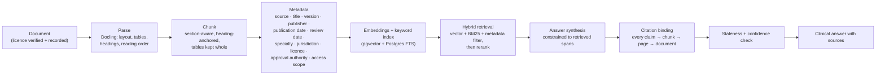

# Medical Literature and Evidence Layer

**Deliverable 10 of the brief.** Design for how the system could answer clinician questions from high-quality sources, and how institution-approved knowledge is handled.

**Scope decision up front: this is NOT in the MVP.** It does not serve the time-saving hypothesis, it carries the largest licensing surface in the product, and it is a different product shape (OpenEvidence-shaped). It is specified here so the architecture does not preclude it, and so that when it is built it is built correctly. **Phase 2 at the earliest.**

---

## 1. The two distinct knowledge problems (do not conflate them)

| | **A. Institutional knowledge** | **B. Published evidence** |
|---|---|---|
| Content | The clinic's own SOPs, protocols, formularies, approved guideline copies, licensed textbooks | Peer-reviewed literature, systematic reviews, national/international guidelines |
| Volume | Hundreds to low thousands of pages | Millions of documents |
| Licensing | Clinic-owned or clinic-licensed; **we must verify the licence covers machine ingestion** ⚖️ | Publisher-licensed; expensive; the reason OpenEvidence has journal partnerships |
| Update cadence | Occasional, controlled | Continuous |
| Our position | **Feasible and defensible in Phase 2** | **Not our product.** Integrate or link out. |

**Recommendation:** build A. For B, integrate with an existing licensed evidence provider rather than assembling a corpus. Assembling a literature corpus without licences is legally and reputationally fatal, and assembling one *with* licences is a different company. **[Inference — strongly held]**

---

## 2. Architecture comparison for institution-approved knowledge

| Approach | Fit | Verdict |
|---|---|---|
| **RAG (retrieval-augmented generation)** | Content changes without retraining; citations are native; access control per source is enforceable at retrieval time; licensed material is *retrieved*, not *absorbed into weights* | ✅ **Chosen** |
| **Fine-tuning on the corpus** | Bakes copyrighted content into weights (a licensing problem *and* an unlearnable one), no citations, no per-source access control, expensive to update, unauditable | ❌ **Rejected** — and note that *"copyrighted books cannot be used for training unless licensing permits"* makes this not merely suboptimal but legally hazardous ⚖️ |
| **Structured clinical knowledge base** (rules, decision tables, formulary tables) | Deterministic, testable, clinician-authorable, no hallucination surface | ✅ **Chosen for the safety-critical subset** — red flags, dose limits, formulary, protocol triggers |
| **Hybrid** | Structured KB for anything safety-critical or deterministic; RAG for narrative guidance with citations; **never RAG for a value a table can hold** | ✅ **The actual design** |

**The rule:** *if a wrong answer would change management, it lives in a structured table with a clinician's name on it. If it is guidance the clinician will read and judge, it can be retrieved narrative with a citation.*

---

## 3. Ingestion workflow for authorised material



**Gates in this pipeline:**
- **A document without a recorded licence and a named approving authority cannot be ingested.** Enforced in the schema (`KnowledgeSource.licence_ref` and `approved_by` are NOT NULL). ⚖️
- **Chunking is section-aware.** Splitting a dosing table in half is a patient-safety bug, not a retrieval-quality nuisance.
- **Every chunk retains its page and offset**, so a citation resolves to a highlighted region of the original.
- **Access scope is enforced at retrieval**, so a clinic's private protocol is never retrievable by another tenant. A tenancy bug in RAG is a data breach. 🔐

---

## 4. Required shape of an evidence answer

Every answer returns this structure — never a bare paragraph:

```json
{
  "question": "First-line management of uncomplicated community-acquired pneumonia in adults, per our institutional protocol",
  "answer_claims": [
    {
      "claim": "…",
      "citation_id": "cit_01",
      "confidence": "high|moderate|low",
      "supported_span": "exact quoted excerpt from the source"
    }
  ],
  "citations": [
    {
      "id": "cit_01",
      "source_title": "…",
      "source_type": "institutional_protocol|clinical_guideline|systematic_review|rct|narrative_review|textbook",
      "publisher": "…",
      "publication_date": "2024-06-01",
      "version": "3.2",
      "next_review_date": "2026-06-01",
      "page": 14,
      "excerpt": "…",
      "relevance_score": 0.87,
      "url_or_internal_ref": "…",
      "staleness": {
        "is_potentially_outdated": true,
        "reason": "Past its stated review date (2026-06-01)"
      }
    }
  ],
  "coverage": {
    "answered_from_sources": true,
    "unsupported_aspects": ["Paediatric dosing not covered by the retrieved sources"]
  },
  "disclaimer": "Institutional reference information for clinician use. Not a treatment recommendation."
}
```

**Hard rules:**
- **A claim without a citation is not rendered.** If the retriever returns nothing relevant, the correct output is *"no institutional source addresses this"* — not a generated answer from the model's parametric memory. This is the single most important rule in this document.
- **Staleness is computed deterministically** from the source's stated review date and flagged in the UI, because an out-of-date guideline confidently cited is worse than no answer.
- **Evidence type is surfaced**, so a clinician can weight a systematic review differently from a narrative review.
- **`unsupported_aspects` is mandatory** — naming what the answer does *not* cover is how the tool avoids implying completeness.

---

## 5. Why this is not in the MVP

| Reason | Detail |
|---|---|
| It does not serve the primary hypothesis | The pilot tests whether pre-round information saves consultation time. Literature Q&A is orthogonal. |
| Licensing lead time | Verifying that the clinic's textbooks and guideline copies permit machine ingestion is a legal exercise measured in months ⚖️ |
| Evaluation cost | A Q&A surface requires its own hallucination evaluation harness, its own clinical review, and its own red-team programme |
| It changes the regulatory conversation | Answering clinical questions is closer to "inform clinical management" than organising a patient's own data |
| An alternative exists today | Clinicians already use dedicated evidence tools. We do not need to be one. |

**What we do in the MVP instead:** nothing. No literature retrieval, no guideline citation, no clinical Q&A surface. The schema (`KnowledgeSource`, `Citation`) exists so Phase 2 is an addition rather than a migration.
