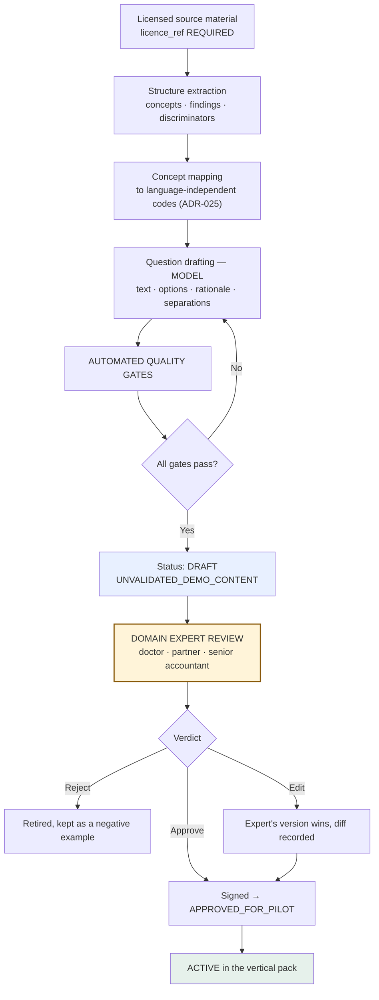

# AI-Assisted Question Bank Generation

**Answers the founder's question:** *"Question bank AI ko harness karke medical literature se design bhi to kiya ja sakta hai — that will improve over time?"*

**Short answer: yes for drafting, no for authorising — and the binding constraint is licensing, not capability.**

---

## 1. Three things that get conflated

| | What it means | Can AI do it? |
|---|---|---|
| **Drafting** | Turn source material into structured candidate questions with rationale, options, translations | ✅ **Yes, and it should.** ~10× faster than a human |
| **Authorising** | Deciding a question is safe and correct to put in front of a real client or patient | ❌ **No.** A named domain expert signs. Unchanged (ADR-015) |
| **Improving** | Learning which questions actually discriminate, and reordering | ⚠️ **Yes, but only through the governed offline loop** (ADR-018, ADR-023) — never automatically |

The instinct is right on all three. The design below keeps them separate, because the failure mode is a generated bank quietly becoming production content.

## 2. The binding constraint is licensing ⚖️

**This decides whether the idea is viable at all.**

Most medical literature — journals, textbooks, clinical references — is **copyrighted**. Using it at scale to generate a commercial question bank is not a grey area, and **scale makes it worse**, because volume makes it look deliberate rather than incidental.

| Source type | Usable for a commercial question bank? |
|---|---|
| **Public health-ministry / government guidance** (Kemenkes, WHO, national primary-care guidance) | ✅ Usually — **verify the specific licence** |
| **Open-access literature with a permissive licence** (CC-BY etc.) | ✅ With attribution — check each |
| **Standard history-taking frameworks taught universally** | ✅ Generally — the *structure* is not owned, though a *specific published instrument* may be |
| **Content the customer already licenses** (their SOPs, protocols, formulary) | ✅ **Best source** — and it is the CUSTOMISE step |
| **The domain expert's own knowledge, written down for us** | ✅ Cleanest of all |
| **Paywalled journals, textbooks, clinical decision references** | ❌ **No.** Not for generation, retrieval, or fine-tuning |
| **Scraped competitor content** | ❌ **No** |

**Hard rule, already in the schema:** every question carries `source_ref`, and `KnowledgeSource.licence_ref` is `NOT NULL`. A question whose source licence is unverified **cannot enter an active pack** — it stays `UNVALIDATED_DEMO_CONTENT`.

**This is OT-05, and this feature makes it bigger.** Clear the licensing audit *before* generating at scale, not after.

## 3. The generation pipeline



**The expert step is not a formality and cannot be batched away.** It is the only thing between a generated question and a real person answering it.

## 4. What the harness tests on generated questions

A new generation suite. Every gate is domain-neutral — which is why the same pipeline works for legal and accounting packs.

| Gate | Rejects | Why |
|---|---|---|
| **Leading question** | *"Do you have crushing chest pain?"* | Invents what the client would not have volunteered |
| **Double-barrelled** | *"Do you have fever and cough?"* | One answer, two facts — unresolvable |
| **Reading level** | Above ~6th grade in any locale | Comprehension is data quality |
| **Unanswerable by the asked party** | *"Is your ejection fraction reduced?"* asked of a patient | `asked_of` must match who can actually answer |
| **Duplicate concept** | Two questions mapping to one concept code | Fatigue, no information gain |
| **Prohibited language** | Diagnosis / advice / reassurance phrasing | Reuses the drift detectors (ADR-016) |
| **Missing discriminator** | A concept cluster with no separating question | Coverage gap — surfaced to the expert |
| **Translation drift** | Back-translation diverges from intent | Meaning survives locale (ADR-025) |
| **No `source_ref`** | Any question without a licensed source | **Hard fail** ⚖️ |

**What this achieves:** the AI generates *and* the harness filters, so the expert reviews a smaller, cleaner set. That is the real saving — not replacing the expert, but making their hour worth ten.

## 5. How it improves over time — the governed loop

```
Live encounter → immutable raw event → expert's final assessment
  → quality checks → eligible labelled example → offline analysis
  → proposed content or ranking change → evaluation on held-out data
  → expert review when materially important → versioned release → rollback available
```

| Signal | What it tells us | Response |
|---|---|---|
| **Expert added their own question** | The bank is missing something | **Highest-value input.** Becomes a generation prompt next version |
| **Rated redundant / not useful** | Low discriminating value in practice | Retirement candidate — expert decides |
| **High skip or abandonment rate** | Confusing, intrusive, badly worded | Rewrite and re-test |

**Hard boundaries (unchanged):** no online learning · no automatic prompt mutation · no autonomous rule creation · no automatic deployment from feedback ratings · shadow scores are rankings not probabilities (ADR-023) · **a statistic never retires expert-signed content on its own.**

## 6. The insight worth acting on

**This pipeline is not internal tooling. It is the product's core commercial mechanism.**

```
Firm uploads their own SOPs / protocols / precedents
  → we generate a candidate question bank for their domain
    → their expert reviews, edits and signs it
      → it becomes their vertical pack
```

That **is** CUSTOMISE, productised — and it is what makes the horizontal thesis executable. Without it, every new vertical needs months of manual authoring. With it, onboarding a domain is a workflow.

It also solves licensing in the cleanest way: **the customer's own licensed material is the best source.** They already hold the rights, and the resulting pack is theirs.

## 7. What to build, and when

| Phase | Build |
|---|---|
| **Now** | This design only. No generation until OT-05 clears |
| **With the MVP** | The quality gates — mostly the drift detectors already built |
| **Before the pitch** | One demo pack from clearly-licensed sources, marked `UNVALIDATED_DEMO_CONTENT` |
| **At CUSTOMISE** | Generate from the customer's own material — the real workflow |
| **Phase 2** | The offline ranking loop, once shadow data exists |

**Do not generate at scale before OT-05 clears.** A large bank built from unlicensed sources is worse than none, because it must be thrown away and regenerated.
