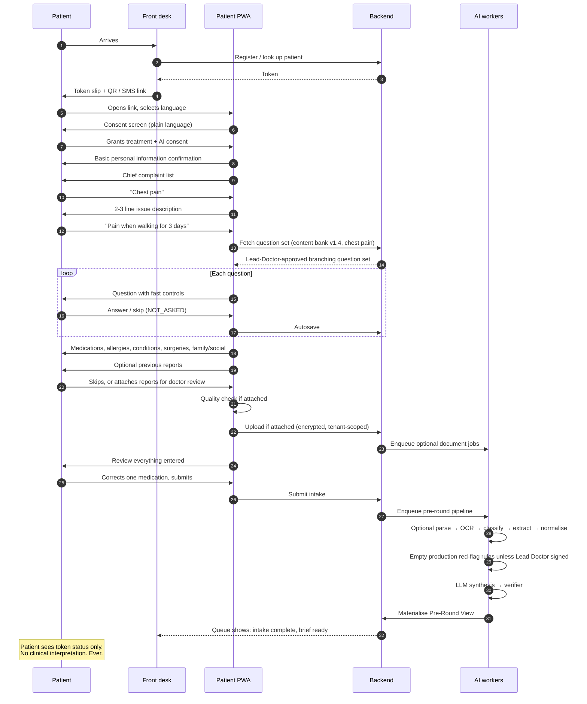
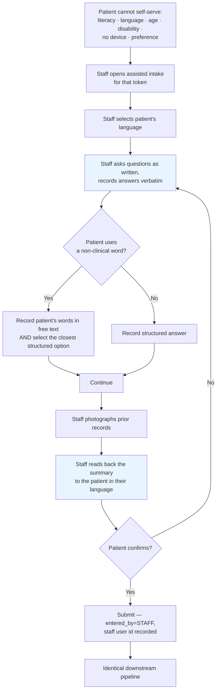
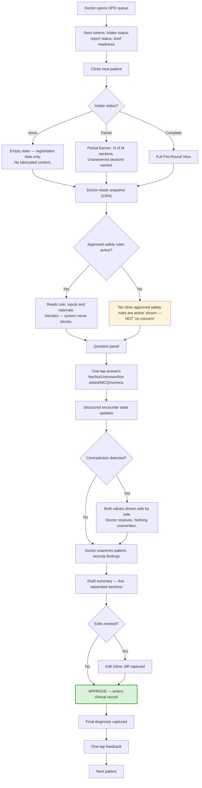
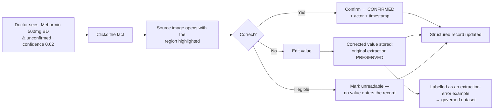
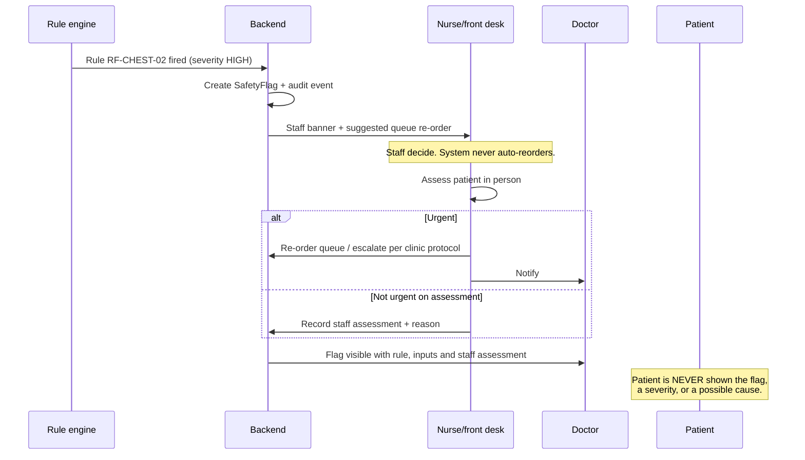
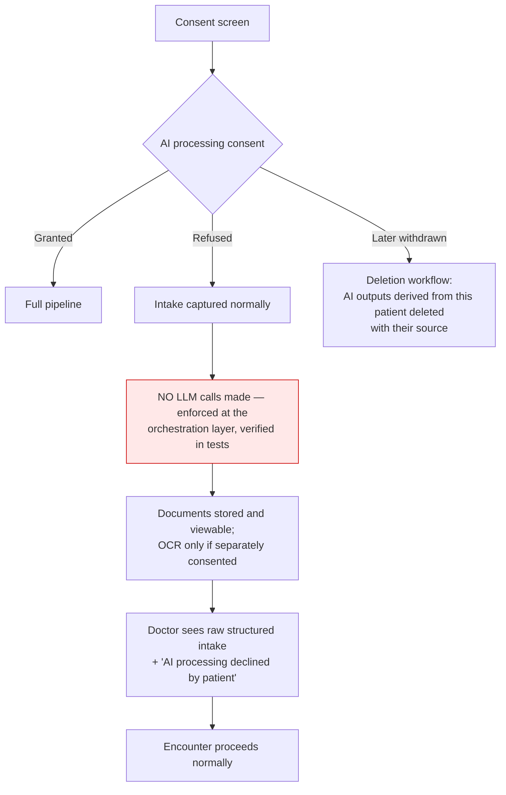

# User Flows

## 1. Patient self-service intake (happy path)

## 2. Staff-assisted intake

**Design note:** the read-back step (J) is not politeness. It is the accuracy control that makes staff-assisted data trustworthy, and it is a required step, not an optional one. 🩺

## 3. Doctor consultation flow

## 4. Document correction flow

## 5. Red-flag escalation while the patient is still waiting

## 6. Consent refusal flow

