# Deliverable 4 — Clinical Workflow

**Scope:** the end-to-end path from a patient arriving at an OPD to a signed encounter and captured feedback.
**Assumption stated up front:** multi-specialty outpatient clinic, 3–7 minute consultations, 40–80 patients per doctor per session, desktop/tablet at the doctor's desk, mixed literacy and language, mixed smartphone ownership.

---

## 1. The workflow as it exists today (the baseline we are changing)

```mermaid
flowchart LR
    A[Patient arrives] --> B[Front desk: register, pay, token]
    B --> C[Wait]
    C --> D[Enter consult room]
    D --> E["Doctor takes history<br/>(2-4 min of a 5 min slot)"]
    E --> F["Doctor reads paper bag<br/>of prior records"]
    F --> G[Examination]
    G --> H[Assessment + plan]
    H --> I[Handwritten prescription]
    I --> J[Patient leaves]

    style E fill:#ffe0e0,stroke:#c00
    style F fill:#ffe0e0,stroke:#c00
```

**The observation the whole product rests on:** the two red boxes are *information retrieval*, they consume the majority of the encounter, and **the patient was sitting idle for 40 minutes immediately before them.** [Inference — to be quantified in discovery, see Open-Questions B2 and the time-baseline study]

---

## 2. The workflow with the pre-round system

```mermaid
flowchart TD
    subgraph REG["1 · Registration"]
        A1[Patient arrives] --> A2{Existing patient?}
        A2 -->|No| A3[Register: demographics, ID, consent]
        A2 -->|Yes| A4[Look up + verify identity]
        A3 --> A5[Issue token · bind intake session]
        A4 --> A5
    end

    subgraph INTAKE["2 · Intake (in the waiting area)"]
        A5 --> B1{Can the patient<br/>self-serve?}
        B1 -->|Yes| B2["Patient PWA<br/>(own phone / clinic tablet)"]
        B1 -->|No| B3["Staff-assisted intake<br/>(trained staff, same data model)"]
        B1 -->|Caregiver| B4["Caregiver-assisted<br/>(relationship recorded)"]
        B2 --> B5[Chief complaint]
        B3 --> B5
        B4 --> B5
        B5 --> B6["Branching symptom questions<br/>from the clinician-authored bank"]
        B6 --> B7[Meds · allergies · comorbidities ·<br/>surgeries · family/social history]
        B7 --> B8["Upload / photograph<br/>prior records"]
        B8 --> B9[Review + submit]
    end

    subgraph AI["3 · Pre-round processing (async, before the doctor opens it)"]
        B9 --> C1[Deterministic validation<br/>+ completeness check]
        C1 --> C2[Document pipeline:<br/>parse → OCR → classify → extract]
        C2 --> C3[Clinical normalisation<br/>+ terminology mapping]
        C3 --> C4["Deterministic RED-FLAG rules<br/>(code, not model)"]
        C3 --> C5["LLM synthesis of the<br/>Pre-Round View (provenance-bound)"]
        C5 --> C6["Verifier: every statement<br/>traceable to a source span?"]
        C6 -->|fail| C7[Degrade to raw structured view<br/>+ flag for review]
        C6 -->|pass| C8[Materialise Pre-Round View]
        C4 --> C8
        C3 -.shadow mode.-> C9["Differential engine<br/>+ question ranker<br/>(NOT shown in v1)"]
        C9 -.-> C10[(Eval + adjudication store)]
    end

    subgraph DOC["4 · Consultation"]
        C8 --> D1[Doctor opens OPD queue]
        C4 --> D1
        D1 --> D2["Patient snapshot<br/>(≤30 second read)"]
        D2 --> D3[Quick-answer question panel]
        D3 --> D4[Structured encounter state updates]
        D4 --> D5["Doctor examines patient<br/>+ records findings"]
        D5 --> D6[Assembled draft summary<br/>with separated sources]
        D6 --> D7{Doctor edits}
        D7 --> D8["APPROVE — only now does it<br/>enter the clinical record"]
    end

    subgraph FB["5 · Feedback + close"]
        D8 --> E1[Final clinician diagnosis captured]
        E1 --> E2[One-tap feedback on<br/>each AI element]
        E2 --> E3[(Feedback + label store)]
        E3 --> E4[Analytics · eval · governance review]
    end

    style C4 fill:#ffd9d9,stroke:#c00,stroke-width:2px
    style C9 fill:#e8e8e8,stroke:#888,stroke-dasharray: 5 5
    style D8 fill:#d9f2d9,stroke:#080,stroke-width:2px
```

---

## 3. Stage detail

### Stage 1 — Registration and token

| Element | Design |
|---|---|
| **Who** | Front-desk staff (default) or patient self-registration where the clinic allows |
| **Data** | Name, age/DOB, sex, contact, optional identifier (ABHA/MRN), relationship of any accompanying person |
| **Consent** | Two distinct consents captured and stored separately: (1) treatment/record consent per clinic policy; (2) **explicit consent to AI-assisted processing of intake and uploaded documents**, in the patient's language, with a plain-language explanation. A third, separate, revocable opt-in covers de-identified product improvement — **defaulted off**. 🔐 |
| **Token** | Deterministic queue service. Token number, session, doctor, arrival time. **Never LLM-generated, never LLM-reordered.** |
| **Binding** | The intake session is bound to `(tenant, patient, encounter, token)` at creation. Every subsequent artefact — every answer, every document — inherits that binding. **This is the primary control against wrong-patient association.** |
| **Handover** | Intake link delivered as SMS/QR to the patient's phone, or opened directly on a clinic tablet, or started by staff. All three produce the same encounter. |

### Stage 2 — Intake

**Three entry modes, one data model.** This is a hard architectural rule: staff-assisted intake is not a lesser path, it writes exactly the same structures, and the only difference is the value of `entered_by` and `entry_mode`.

| Mode | When | Provenance recorded |
|---|---|---|
| **Patient self-service** | Literate, comfortable, has a device | `entered_by = PATIENT` |
| **Caregiver-assisted** | Elderly, paediatric, disability, low literacy | `entered_by = CAREGIVER` + relationship + caregiver identity |
| **Staff-assisted** | Language, literacy, disability, age, no device, or patient preference | `entered_by = STAFF` + staff user id |
| **Imported** | From a prior encounter or an external record | `entered_by = IMPORT` + source |
| **AI-derived** | Extracted from an uploaded document, or inferred | `entered_by = AI` + model version + confidence + source span |

**Intake content, in order:**

1. **Chief complaint** — selected from a clinician-authored list of the clinic's top complaints, plus free text with an "other" path. *Selection, not free text, is what makes the rest of the flow possible.*
2. **Symptom detail** — a branching question set specific to that complaint, from the content bank. Onset, duration, character, severity, aggravating/relieving factors, associated symptoms, prior episodes. **Deterministic branching**; the LLM does not choose the questions in v1.
3. **Red-flag screen** — a small number of high-sensitivity questions embedded in the flow, deliberately not signposted as such to the patient.
4. **Current medications** — search-as-you-type against a curated brand/generic list, plus photo-of-the-strip capture, plus free text. *Explicitly allowed to be incomplete;* "I don't know" is a first-class answer and is recorded as such rather than as absence.
5. **Allergies** — drug, food, other, plus reaction type. "None known" and "not asked" are **different values** and must never be conflated.
6. **Known conditions / comorbidities** — checkbox list of the common ones plus free text.
7. **Previous procedures / surgeries** — with approximate year.
8. **Family and social history** — scoped tightly to what changes management: smoking, alcohol, occupation-relevant exposures, key family conditions. *Everything here is optional and skippable.* Sensitive social history is minimised by design (see [Privacy.md](../05-Security-Compliance/Privacy.md)).
9. **Document upload** — described below.
10. **Review + submit** — the patient sees everything they entered, in their own language, and can correct it.

**Design rules for intake:**
- **Never block on a question.** Every question is skippable; skipped becomes `NOT_ASKED`, which the doctor sees as a gap rather than a negative.
- **Save continuously.** A patient called into the room mid-intake must lose nothing, and the doctor must still get whatever was completed, clearly marked partial.
- **Time-box it.** Target median completion ≤6 minutes. If the bank exceeds that, the bank is too long — cut questions, not comprehension.
- **Language is chosen once and applies everywhere**, including the review screen and the confirmation.
- **Nothing clinical is shown back to the patient.** No interpretation, no severity, no possible causes. The review screen is a mirror, not an opinion.

### Stage 3 — Document ingestion

```mermaid
flowchart LR
    U["Upload / camera capture"] --> V["Client-side quality check<br/>blur · glare · edges · page count"]
    V --> W["Virus scan + type validation<br/>+ encrypt at rest"]
    W --> X["Preprocess: deskew, denoise,<br/>crop, enhance contrast"]
    X --> Y{Digital text layer?}
    Y -->|Yes| Z1["Direct text extraction (Docling)"]
    Y -->|No| Z2["OCR tier 1 (PaddleOCR)"]
    Z2 --> Z3{Page confidence<br/>above threshold?}
    Z3 -->|No| Z4["OCR tier 2<br/>(commercial API fallback)"]
    Z3 -->|Yes| AA
    Z4 --> AA
    Z1 --> AA["Document classification<br/>prescription · lab · radiology ·<br/>discharge · consult note · other"]
    AA --> AB["Type-specific structured extraction"]
    AB --> AC["Medications · problems · lab values<br/>+ units + reference ranges · dates"]
    AC --> AD["Normalisation + terminology mapping"]
    AD --> AE["Duplicate + contradiction detection<br/>across documents"]
    AE --> AF["Confidence scoring per FACT<br/>(not per document)"]
    AF --> AG{High-risk field?<br/>med · dose · allergy · critical lab}
    AG -->|Yes| AH["State = UNCONFIRMED<br/>requires human confirmation"]
    AG -->|No| AI["State = EXTRACTED"]
    AH --> AJ[(ExtractedClinicalFact<br/>+ source span + page + bbox)]
    AI --> AJ

    style AH fill:#ffd9d9,stroke:#c00
```

**Non-negotiables in this pipeline:**
- **The source document is preserved permanently and is one click from every extracted fact**, with the exact page and bounding box highlighted. A doctor must be able to verify a value in under two seconds.
- **Confidence is per fact, not per document.** A crisp printed header and a smudged drug name on the same page get different scores.
- **High-risk fields are `UNCONFIRMED` until a human confirms them.** Medications, doses, allergies and critical lab values never enter the structured record on OCR's word alone.
- **Duplicates are detected, not merged silently.** Two documents reporting the same HbA1c produce one fact with two sources; two documents *disagreeing* produce a surfaced contradiction, never a silent winner.
- **Patient identity is cross-checked** against any name/ID visible in the document header. A mismatch blocks attachment and raises a staff task. This is the second control against wrong-patient association.
- **Nothing here is synchronous with the doctor's click.** It all completes while the patient is still in the waiting room.

### Stage 4 — The consultation

**The doctor's path, in target interaction counts:**

| Step | Interactions | Target time |
|---|---|---|
| Open queue → open patient | 1 click | <2s load |
| Read snapshot | 0 | **≤30s** |
| Answer suggested questions | 4–8 taps | 30–60s |
| Record own findings | variable | clinician-controlled |
| Review draft summary | scroll | 15–30s |
| Edit | 0–2 fields | 10–20s |
| Approve | 1 click | — |
| Feedback | 1–3 taps | 5s |

**What the doctor sees, in priority order, above the fold:**
1. Identity + token + age/sex + **red-flag banner if any rule fired**
2. Chief complaint and duration, in one line
3. Symptom timeline (visual, not paragraphs)
4. **Allergies** (always visible, always in the same place, never below the fold)
5. Current medications, with unconfirmed items visually distinct
6. Known conditions
7. Significant positives / significant negatives, side by side
8. Abnormal prior labs with dates and trend arrows
9. **Missing information** — explicitly named, not implied by absence
10. Links: source documents, full history, timeline

**Interaction rules:**
- **Every AI-derived element carries a provenance chip** (`Patient` / `Staff` / `Caregiver` / `Record` / `AI`) and AI/OCR items are additionally clickable to the source.
- **No modal dialogs. No confirmations except the final approve.** A doctor interrupted mid-modal loses the encounter.
- **Keyboard-first.** Every question answerable without the mouse; number keys map to options.
- **The absence of a red flag is displayed as "no rule triggered", never as "no concern".** This wording is a safety control, not copy-editing.

### Stage 5 — Summary, approval and feedback

The assembled summary has **five structurally separate sections that are never merged**:

| Section | Source | Visual treatment |
|---|---|---|
| 1. Patient-reported | Intake, `entered_by ∈ {PATIENT, CAREGIVER, STAFF}` | Neutral |
| 2. Historical record | Extracted from documents, `CONFIRMED` | Neutral + source link |
| 3. Observed / confirmed in consultation | Doctor's answers and findings | Emphasised |
| 4. **AI-generated interpretation** | Synthesis, considerations, prompts | **Visually distinct container, labelled, collapsible** |
| 5. Doctor's final assessment | Free text + coded diagnosis | Authoritative, last |

- **Nothing is written to the clinical record until the doctor presses Approve.** Before that it is a draft artefact with a distinct lifecycle state, and it is never exported, printed, or transmitted.
- **Edits are diffed and stored.** The delta between AI draft and approved note is one of the most valuable signals the product generates — it is the supervision label for every future improvement.
- **Final clinician diagnosis is captured** (coded where possible, free text otherwise) plus, optionally, an alternative considered. This is the outcome label.
- **Feedback is one tap and never mandatory.** A feedback prompt that blocks the next patient will be dismissed forever within a week.

---

## 4. Exception and edge paths (these are the ones that decide whether it works in a real clinic)

| Situation | Behaviour |
|---|---|
| **Intake not started** | Doctor sees a clearly-labelled empty state with registration data only. **No fabricated content, no partial summary.** The queue shows intake status so this is never a surprise. |
| **Intake partial** | Everything completed is shown, prominently marked *Partial intake — N of M sections*, with the unanswered sections named. |
| **Patient called before intake finished** | Session freezes, current state is delivered, patient may resume after if relevant. |
| **Documents still processing when the doctor opens the patient** | Snapshot renders immediately without them; a non-blocking indicator shows extraction in progress; the raw document is viewable meanwhile. **The doctor is never made to wait for AI.** |
| **OCR failed / unreadable document** | Marked `EXTRACTION_FAILED`. The image is still shown. **No guessed values, ever.** |
| **Contradiction between intake and a document** (e.g. patient says no diabetes, discharge summary says T2DM) | Both shown, side by side, flagged as a contradiction to resolve. The system does not pick a winner. |
| **Red flag fires while patient is still waiting** | Staff-side banner + suggested queue re-order to the front desk. **Staff decide; the system never auto-reorders and never messages the patient.** 🩺 |
| **Paediatric / pregnant / elderly patient** (v1) | Cohort detected → **AI synthesis and red-flag rules are suppressed**; the doctor sees raw structured intake with an explicit "not validated for this cohort" notice. Deliberate, conservative, and reversible once validated. |
| **Patient refuses AI processing** | Intake still captured and shown raw; no LLM call is made; the encounter proceeds. Consent is meaningful only if refusal is functional. 🔐 |
| **Patient withdraws consent later** | Deletion workflow per [Privacy.md](../05-Security-Compliance/Privacy.md); AI outputs derived from their data are deleted with the source. |
| **System unavailable** | The clinic must be able to run without us. Degraded mode = registration and token only; the doctor's existing paper/EMR workflow is untouched. **We are never a single point of failure for care delivery.** |
| **Duplicate patient records** | Staff-resolved merge with full audit; never automatic. |
| **Doctor disagrees with everything** | Approve-with-full-replacement is a supported, one-click path, and is captured as a strong negative signal. |

---

## 5. Roles and responsibilities

| Role | Does | Explicitly does not |
|---|---|---|
| **Patient** | Provides history, uploads records, consents | See interpretation, differentials, or risk scores |
| **Caregiver** | Provides history on the patient's behalf, with relationship recorded | Anything the patient hasn't authorised |
| **Front-desk staff** | Registration, token, consent capture, document capture | Enter clinical interpretation |
| **Assisted-intake staff** | Enter intake on the patient's behalf, verbatim, in the patient's words | Paraphrase into clinical language, or answer on the patient's behalf |
| **Nurse / triage** | Act on red flags, re-order queue, capture vitals | Diagnose |
| **Doctor** | Everything clinical: verify, question, examine, decide, approve | Delegate the decision to the system |
| **Clinical safety owner** | Author and sign the question bank and red-flag rules; review safety events | Delegate authorship to engineering |
| **Admin** | Users, roles, content versions, retention config | Access clinical content without a logged clinical reason |

---

## 6. Where the clinician's authority is enforced *structurally* (not just by policy)

1. Only a `DOCTOR`-role user can transition an encounter to `SIGNED`.
2. AI outputs are written to a **separate table** (`ai_output`) and can never be written directly into `observation`, `condition`, `medication_statement` or `allergy` — promotion requires a clinician action that creates its own audit event.
3. `ExtractedClinicalFact` has an explicit `verification_status`; high-risk categories cannot reach `CONFIRMED` without a human actor id.
4. The draft note has a distinct lifecycle state (`DRAFT` → `APPROVED`) and is excluded from all export, print and integration paths while `DRAFT`.
5. Every override is recorded with the pre- and post-values and the acting user.

*Policy can be forgotten. Schema constraints cannot.*
