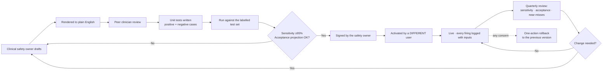

> ### ⚠️ v2 AMENDMENT — this content does not ship in the MVP
>
> The rule **engine** ships. The rule **set is empty**. Every rule below is a structural template showing the *shape* an authored rule takes — it is not content to be loaded.
>
> The lead doctor at clinic 1 authors the real rules during CUSTOMISE, starting from nothing. That is deliberate: it is the cleanest regulatory starting position, it removes the need for a clinical retainer before the pitch, and *"you write the safety rules for your own clinic"* is a better opening conversation than *"adopt our doctor's rules."*
>
> **The floor:** no urgency signal, no triage language and no red flag of any kind reaches a screen until a named doctor has authored and signed the rules. An empty rule set is safe. An engineer-authored one is not.

# Red-Flag Rules

> 🩺 **This document is a structural template and a worked example, not a clinical rule set.**
> Every rule below is **illustrative** and must be authored, reviewed, amended and signed by the named clinical safety owner before any implementation. Engineering does not author red flags. Nothing here is validated for clinical use.

---

## 1. Design principles

1. **Deterministic.** A rule is a declarative expression over structured fields. Same input, same output, forever.
2. **Readable by a clinician.** A rule must render back to a physician as a sentence they can agree or disagree with.
3. **Versioned and signed.** Two-person control: the author cannot be the activator.
4. **High sensitivity, tolerated false positives** — but bounded by the acceptance metric (S3), because a flag that is ignored is worse than no flag.
5. **Informing, never diagnosing.** Message wording says what to *do* (assess promptly), not what it *is*.
6. **Scoped.** Every rule declares which chief complaints and which cohorts it applies to. A rule with no scope is a bug.
7. **Explainable.** Every firing records the exact input values that triggered it.
8. **Non-blocking.** A flag never prevents any workflow step.

## 2. Rule expression format

Rules are stored as a declarative AST, evaluated by a small interpreter. No embedded code, no `eval`, no model.

```json
{
  "rule_key": "RF-CHEST-02",
  "version": "content@1.4.0",
  "chief_complaint_scope": ["chest_pain"],
  "cohort_scope": { "exclude": ["paediatric", "pregnancy"] },
  "severity": "HIGH",
  "expression": {
    "all": [
      { "field": "response.q_cp_exertion", "op": "eq", "value": "YES" },
      { "field": "patient.age", "op": "gte", "value": 45 }
    ]
  },
  "message_template": "Chest pain with exertional relationship, age {{patient.age}} — assess promptly",
  "suggested_action": "Prioritise assessment; consider ECG per clinic protocol",
  "clinical_rationale": "UNVALIDATED_DEMO_CONTENT: exertional chest pain in a patient over 45 is used here as a demo trigger for prompt assessment workflow. It is not a calibrated disease probability or production rule.",
  "evidence_reference": "[to be supplied by the clinical safety owner]",
  "authored_by": "[clinician]",
  "signed_at": null
}
```

**Rendered back to the clinician for review as:**
> *If the patient's chief complaint is chest pain, AND they answered YES to "worse on exertion", AND their age is 45 or over, AND they are not paediatric or pregnant — raise a HIGH flag saying "assess promptly".*

If a physician cannot read that sentence and immediately say yes or no, the rule format has failed.

## 3. Illustrative rule structure by complaint 🩺

*Placeholders showing the shape only. Thresholds, combinations and inclusion are entirely for the clinical safety owner to determine.*

| Rule key | Complaint scope | Structure (illustrative) | Severity |
|---|---|---|---|
| `RF-CHEST-01` | chest_pain | Chest pain + associated autonomic features | HIGH |
| `RF-CHEST-02` | chest_pain | Chest pain + exertional relationship + age threshold | HIGH |
| `RF-CHEST-03` | chest_pain | Chest pain + known cardiac history | HIGH |
| `RF-BREATH-01` | breathlessness, chest_pain | Breathlessness at rest + recent onset | HIGH |
| `RF-NEURO-01` | headache, weakness, dizziness | Sudden-onset focal neurological symptom | HIGH |
| `RF-NEURO-02` | headache | Sudden severe headache, maximal at onset | HIGH |
| `RF-ABDO-01` | abdominal_pain | Severe abdominal pain + specific associated features | HIGH |
| `RF-FEVER-01` | fever | Fever + altered consciousness / rash / stiff neck | HIGH |
| `RF-FEVER-02` | fever | Prolonged fever beyond a duration threshold | MEDIUM |
| `RF-BLEED-01` | any | Reported active bleeding | HIGH |
| `RF-MED-01` | any | Anticoagulant on the medication list + any bleeding symptom | HIGH |
| `RF-VITAL-01` | any | Recorded vital outside a defined range *(Phase 2 — requires vitals capture)* | HIGH |
| `RF-DM-01` | diabetes_followup | Documented HbA1c above a threshold + symptoms | MEDIUM |
| `RF-GEN-01` | any | Unintentional weight loss over a threshold | MEDIUM |
| `RF-GEN-02` | any | Patient or staff reports the patient appears unwell | HIGH |

**`RF-GEN-02` is deliberately included as a template item:** a free-text or checkbox escape hatch for staff observation is one of the most valuable "rules" in any triage system, and it requires no model at all. 🩺

## 4. What is deliberately excluded from the rule set

| Excluded | Why |
|---|---|
| Anything requiring examination findings | Not available pre-consultation in v1 |
| Anything requiring vitals | Vitals capture is Phase 2; rules referencing them are staged but inactive |
| Paediatric-specific rules | Cohort gated out of v1 |
| Obstetric rules | Cohort gated out of v1 |
| Rules over free text | Free text is not reliably parseable into a deterministic rule input. **Rules read structured fields only.** |
| Rules over AI-inferred values | A safety rule reading a model's output would make the rule non-deterministic. **Rules read patient/staff-entered structured answers and human-confirmed facts only.** |
| Composite "risk scores" of our own invention | If a validated score exists, implement the validated score. If not, do not invent one. 🩺 |

**The last two exclusions are architecturally significant** and should not be relaxed without an explicit decision: they are what keeps the safety layer deterministic end-to-end.

## 5. Rule lifecycle



## 6. Testing requirements

| Test type | Requirement |
|---|---|
| Unit | Every rule has positive and negative cases, including boundary values on every threshold |
| Cohort | Every rule tested for correct suppression on excluded cohorts |
| Regression | The full labelled test set runs on every content-version change; **the set only grows** |
| Sensitivity | ≥95% on adjudicated red-flag-positive cases (metric S2) |
| Acceptance projection | Estimated firing rate per 100 encounters computed before activation, so alert load is known in advance rather than discovered |
| Explainability | Every firing's `input_snapshot` reproduces the decision exactly |

## 7. What a red flag is *not*

- Not a diagnosis
- Not a triage category
- Not a risk score
- Not a recommendation to treat
- Not a substitute for staff triage or clinical observation
- **Not a guarantee.** The absence of a flag means *no rule matched* — nothing more. The UI says exactly this, and that wording is not open to marketing revision.

## v2.2 Reconciliation

All red-flag content before Lead Doctor review is `UNVALIDATED_DEMO_CONTENT`. Production rule content remains inactive until clinic review and signed activation. UI language must avoid `No red flags`, `No concern detected`, or any safety-clearance wording.

