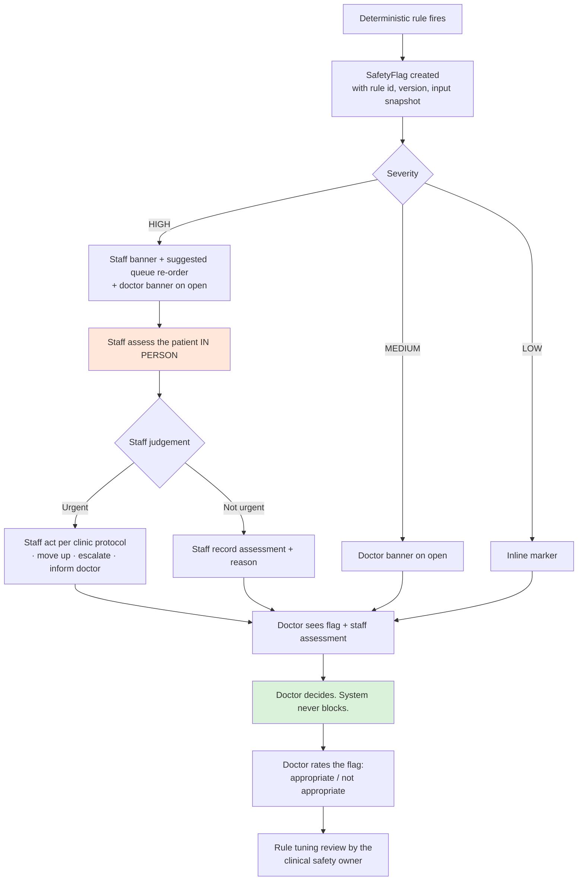

# Deliverable 13 (part 1) — Patient-Safety Architecture

Every significant clinical failure mode, in the form the brief requires:
**Risk → Clinical impact → Detection → Prevention → Human safeguard**

🩺 = requires clinical review and sign-off before implementation.

---

## 1. Failure mode register

### FM-01 · Hallucinated clinical statement in the summary

| | |
|---|---|
| **Clinical impact** | Doctor acts on a symptom, medication or history that the patient never reported. Severity: **critical**. |
| **Detection** | Deterministic **traceability verifier**: every generated statement must map to a source span that exists in the input. Adjudicated sampling of 10% of encounters. `verifier_result` monitored; failure rate alerting at >5%/hour. |
| **Prevention** | Extractive prompting ("using only the text provided"); temperature ≤0.2; strict output schema; span attribution mandatory; no synthesis step permitted to introduce entities absent from the structured state. |
| **Human safeguard** | Provenance chip on every statement; one-click to the source; **the doctor approves before anything enters the record**; "Clinically unsafe" feedback creates a P1 safety event. |
| **Residual risk** | A statement that is traceable but subtly mis-worded. Mitigated by adjudicated sampling, not eliminated. ⚠️ |

### FM-02 · Incorrect medication extraction

| | |
|---|---|
| **Clinical impact** | Wrong drug, dose or frequency presented as current. **The most likely path from this product to patient harm.** Severity: **critical**. |
| **Detection** | Per-fact confidence scoring; cross-check of drug name against the curated formulary; dose plausibility range check; contradiction detection across documents; doctor correction events tracked as metric S4. |
| **Prevention** | Dual-signal extraction (OCR text + layout); handwritten documents always flagged; confidence threshold below which the value is not displayed as a value at all; deterministic dose parsing rather than model-generated dose strings. |
| **Human safeguard** | **`is_high_risk = true` facts cannot reach `CONFIRMED` without `verified_by_user_id` — enforced by a database CHECK constraint.** Unconfirmed items rendered visually distinct with the numeric confidence. Source image one click away. |
| **Residual risk** | A doctor confirming a wrong value without checking the source. Measured by the seeded-error exercise (S11). ⚠️ |

### FM-03 · Missed emergency symptom (red-flag false negative)

| | |
|---|---|
| **Clinical impact** | A patient with a time-critical presentation waits in the queue. Severity: **critical**. |
| **Detection** | Fixed clinician-labelled test set re-run on every rule-version change; sensitivity target ≥95% (metric S2); retrospective review of any adverse event. |
| **Prevention** | **Rules, not models** — deterministic, readable, unit-tested; clinician-authored with two-person activation; high-sensitivity design accepting false positives; red-flag screening questions embedded in intake and not skippable-by-default in the flow design. 🩺 |
| **Human safeguard** | **The absence of a flag is displayed as "no rule triggered", never as reassurance.** Staff triage continues to operate exactly as before — the system is additive, never a replacement for clinical observation. |
| **Residual risk** | A presentation no rule covers. **This is why the UI must never imply that flag-absence means safety**, and why the rule set is reviewed quarterly against near-misses. ⚠️🩺 |

### FM-04 · Inappropriate reassurance

| | |
|---|---|
| **Clinical impact** | Doctor or staff under-weights a presentation because the system's tone implied benignity. Severity: **high**. |
| **Detection** | Prohibited-content guardrail (G3) scanning for reassurance phrasing; copy review by the clinical safety owner; adversarial evaluation set containing cases designed to elicit reassurance. |
| **Prevention** | **Copy rules are a safety control** ([PRD.md](../02-Product/PRD.md) §7): no "appears benign", no "unlikely to be serious", no "reassuring features". The prohibited-phrase list is authored by the clinical safety owner and versioned with the content pack. |
| **Human safeguard** | Clinician review; feedback rating "Clinically unsafe"; quarterly copy audit. 🩺 |

### FM-05 · Inaccurate OCR

| | |
|---|---|
| **Clinical impact** | Any extracted value may be wrong — a lab result, a date, a drug. Severity: **high to critical** depending on field. |
| **Detection** | Per-page and per-field OCR confidence; schema plausibility checks (a date in 2087, an HbA1c of 84%); cross-document consistency; `EXTRACTION_FAILED` state. |
| **Prevention** | Capture-time quality checks with retake prompts; preprocessing; two-tier OCR with fallback; **never a guessed value** — a field that cannot be read is `ILLEGIBLE`, not a best effort. |
| **Human safeguard** | Source image always retained and one click away with the region highlighted; high-risk fields require confirmation; handwritten documents always require confirmation regardless of confidence. |
| **Residual risk** | Confident-but-wrong OCR on a clean-looking document. Mitigated by plausibility checks and human confirmation for high-risk fields; **accepted for low-risk fields**, with the source always available. ⚠️ |

### FM-06 · Wrong patient / wrong document association

| | |
|---|---|
| **Clinical impact** | One patient's records inform another's consultation. Severity: **critical**. **Any occurrence halts the pilot** (metric S7). |
| **Detection** | Identity cross-check of any name/ID visible in the document header against the encounter's patient; audit review; staff report. |
| **Prevention** | Deterministic binding at capture — a document is created against an encounter, never uploaded then assigned; single-encounter upload sessions; **mismatch blocks attachment** and raises a staff task rather than warning-and-continuing. |
| **Human safeguard** | Staff confirmation on any mismatch; patient identity shown on the document review screen; doctor sees the patient identity band on every screen. |

### FM-07 · Automation bias

| | |
|---|---|
| **Clinical impact** | The clinician stops independently verifying, and the system's errors become the clinician's errors. Severity: **high**, and **increasing over time** — the most insidious failure mode in the register. |
| **Detection** | **Periodic blinded seeded-error exercises** (metric S11): a plausible error is introduced into a small number of summaries and the catch rate is measured. A declining catch rate is the early warning. Also: provenance click-through rate, and trust-vs-accuracy calibration in the clinician survey. |
| **Prevention** | Provenance everywhere; explicit "missing information" block; no completeness claims; no probability scores; **no differential in v1**; deliberate friction on high-risk confirmations. |
| **Human safeguard** | Training that names automation bias explicitly; the system never claims completeness; quarterly review of the calibration metric by the clinical safety owner. 🩺 |
| **Note** | This risk is *created by good design*. A summary that is clear, concise and usually right is exactly the kind of artefact people stop checking. We accept the trade-off and measure it. |

### FM-08 · Outdated clinical evidence or stale patient data

| | |
|---|---|
| **Clinical impact** | A two-year-old medication list treated as current; a superseded protocol cited. Severity: **high**. |
| **Detection** | Deterministic staleness computation against document dates and source review dates; `is_current` flag on medications; date always displayed. |
| **Prevention** | Every extracted fact carries its `observed_date`; the UI never displays a clinical value without its date; knowledge sources carry `review_date` and are flagged when past it. |
| **Human safeguard** | Doctor confirms current medications during the consultation; dates are visually prominent, not fine print. |

### FM-09 · Incomplete history presented as complete

| | |
|---|---|
| **Clinical impact** | Doctor believes a topic was covered and negative when it was never asked. Severity: **high**. |
| **Detection** | Completeness computed from the content bank's `is_required_for_completeness` fields; partial-intake state tracked; `NOT_ASKED` counted and displayed. |
| **Prevention** | **`NOT_ASKED`, `UNKNOWN` and a negative answer are three distinct values in the schema, the API, the UI and the FHIR export.** The "Missing information" block is always rendered, even when empty (where it says so explicitly). Partial intake is banner-flagged with the sections named. |
| **Human safeguard** | The doctor sees exactly what was not asked and decides. |
| **Note** | Conflating "not asked" with "no" is the most common defect class in intake systems and is treated here as a **P1 defect**, tested in CI. |

### FM-10 · Contradictory information across sources

| | |
|---|---|
| **Clinical impact** | Two sources disagree; the system silently picks one; the doctor never learns there was a disagreement. Severity: **high**. |
| **Detection** | Deterministic contradiction detection across intake, documents and doctor answers. |
| **Prevention** | **The system never resolves a contradiction.** Both values are stored, both are displayed with their provenance, and the contradiction is surfaced in its own band. |
| **Human safeguard** | Doctor resolves explicitly; resolution recorded with the clinician as the asserting actor; the original values are preserved. |

### FM-11 · AI-generated questions steering the clinician incorrectly

| | |
|---|---|
| **Clinical impact** | A leading or anchoring question narrows the clinician's thinking. Severity: **medium to high**. |
| **Detection** | Question feedback ratings; doctor-added-question rate (a rising rate names gaps); adjudicated review of question sets. |
| **Prevention** | **In v1 the model cannot generate a question. It can only rank a fixed set of clinician-authored questions, and even the ranking is shadow-mode.** The visible order is a clinician-authored decision table. Every question carries a one-line clinical rationale. 🩺 |
| **Human safeguard** | Doctors may skip any question, add their own, and rate questions as unhelpful. Question banks are reviewed quarterly. |

### FM-12 · Language and translation error

| | |
|---|---|
| **Clinical impact** | "Chest heaviness" becomes "chest pain"; a colloquial idiom is mis-mapped; a negation is inverted. Severity: **high**. |
| **Detection** | Back-translation review during content authoring; subgroup performance monitoring by language (metric S8); free-text comparison in adjudication. |
| **Prevention** | **Fixed question banks are translated by clinicians and reviewed, not machine-translated at runtime.** Free text is stored in the original language *and* translated, with both shown to the doctor. Assertion detection is evaluated per language before that language ships. 🩺 |
| **Human safeguard** | Doctor sees the patient's original words; staff-assisted intake includes a mandatory read-back in the patient's language. |
| **Residual risk** | Free-text translation quality. Mitigated by always showing the original. ⚠️ |

### FM-13 · Paediatric, pregnancy and elderly edge cases

| | |
|---|---|
| **Clinical impact** | Adult-tuned rules and question banks misfire — wrong thresholds, wrong red flags, missed obstetric emergencies. Severity: **critical**. |
| **Detection** | Deterministic cohort computation; production assertion; automated test (metric S9). |
| **Prevention** | **In v1 these cohorts are gated out: AI synthesis and red-flag rules are suppressed and the doctor sees raw structured intake with an explicit notice.** This is a deliberate, conservative, reversible choice. 🩺 |
| **Human safeguard** | The notice tells the doctor exactly what is and is not being applied; the queue labels the cohort before the patient is opened. |
| **Phase 2** | Cohort-specific rules and question banks, authored and validated separately, with their own test sets. |

### FM-14 · Prompt injection via patient text or document content

| | |
|---|---|
| **Clinical impact** | Crafted text alters the summary — e.g. asserting no allergies. Severity: **high**. |
| **Detection** | Adversarial test suite in CI; guardrail failures logged and alerted. |
| **Prevention** | Untrusted content is delimited and never concatenated into instructions; strict output schema; **the traceability verifier means an injected assertion has no valid source span**; prohibited-content filter. |
| **Human safeguard** | Provenance and clinician approval. |

### FM-15 · Silent degradation

| | |
|---|---|
| **Clinical impact** | A document failed to process, or synthesis was skipped, and the doctor reads a thin summary believing it is complete. Severity: **high**. |
| **Detection** | Pipeline status tracked per artefact; `generation_mode` on every pre-round view; alerting on pre-round-not-ready. |
| **Prevention** | **There is no silent partial result.** Every degradation sets an explicit mode that the UI must render. Document processing status is shown per document. |
| **Human safeguard** | The doctor always knows which mode they are reading. |

### FM-16 · Cost-driven truncation

| | |
|---|---|
| **Clinical impact** | A budget cap silently drops the last five pages of a discharge summary. Severity: **high**. |
| **Detection** | Budget-cap events logged and alerted. |
| **Prevention** | When a cap is hit, processing **stops and flags**; it never truncates silently. |
| **Human safeguard** | Staff notified to review; the doctor sees which documents were not processed. |

---

## 2. Red-flag escalation pathway

**Rules governing this pathway:**
1. **The system suggests; humans act.** No automatic queue reordering, no automatic notification to anyone outside the clinic, no automatic clinical action.
2. **The patient is never told.** No flag, no severity, no possible cause reaches the patient app. Standing constraint #2.
3. **Staff messaging is operational, not clinical:** *"assess this patient's priority"*, never *"possible cardiac event"*.
4. **Nothing blocks.** A flag the doctor must dismiss to proceed becomes a flag the doctor dismisses reflexively.
5. **Every flag is rated**, and the acceptance rate (metric S3) drives rule tuning. A rule consistently judged inappropriate is reviewed by the clinical safety owner — who decides, not the metric. 🩺

## 3. What the system will never do

| Never | Why |
|---|---|
| Give a patient a diagnosis, differential, triage advice or reassurance | Standing constraint; categorically higher harm surface |
| Auto-reorder a clinical queue | Reorganises clinic operations without a human decision |
| Change a medication list without a human confirmation | FM-02 |
| Assert a finding without a traceable source | FM-01 |
| Present "not asked" as "no" | FM-09 |
| Resolve a contradiction silently | FM-10 |
| Fire a safety rule from a model | FM-03 |
| Generate a clinical question in v1 | FM-11 |
| Continue silently after a component failed | FM-15 |
| Truncate clinical content to save cost without flagging | FM-16 |
| Enter anything into the clinical record without a doctor's approval | Standing constraint #1 |

## 4. Safety governance

| Element | Detail |
|---|---|
| **Clinical safety owner** | A named, contracted, practising physician. Authors and signs all clinical content. Owns the safety register. **Nothing ships without their signature.** |
| **Safety register** | Every event, its severity, root cause, action and closure. Reviewed monthly. |
| **Safety event SLA** | `CLINICALLY_UNSAFE` feedback → triage within 24h, root cause within 5 working days, action recorded. |
| **Change control** | Any change to prompts, rules, question banks, models or the extraction pipeline re-triggers the evaluation suite and requires clinical sign-off before release. |
| **Regression suite** | **Only ever grows.** Every real failure becomes a permanent test case. |
| **Quarterly review** | Rule sensitivity, flag acceptance, subgroup parity, automation-bias calibration, near-miss review. |
| **Kill switch** | A single configuration change disables AI generation tenant-wide, falling back to raw structured views, without a deploy. Tested. |

## v2.2 Reconciliation

Rule activation requires clinical author, reviewer, version, effective date, source/reference, clinic scope, and signed approval state. Empty production packs must render `No clinic-approved safety rules are active`. A non-triggered configured rule means only that no configured trigger fired; it is not comprehensive triage clearance.

