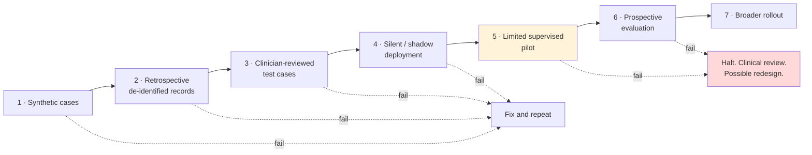

# Deliverable 13 (part 2) / Deliverable 21 — Validation Plan

**Principle: acceptance criteria are defined *before* each stage begins.** A gate defined after seeing the results is not a gate. Every criterion below is fixed before the stage starts and is changed only by a documented decision from the clinical safety owner.

---

## 1. Stage overview

---

## Stage 1 — Synthetic cases

**Purpose:** verify correctness without touching any real patient data.

| Element | Detail |
|---|---|
| **Data** | Synthea-generated cohorts + clinician-authored edge cases + synthetic document images (printed, photographed, deliberately degraded, handwritten facsimiles) |
| **Volume** | ≥500 synthetic encounters covering all 10 complaints, all three intake modes, all three languages, all degraded states |
| **What is tested** | Pipeline correctness; rule engine against the rule table; verifier behaviour; cohort gating; consent gating; provenance completeness; `NOT_ASKED` handling end-to-end |

**Acceptance criteria (all must pass):**
- [ ] Rule engine matches the clinician-authored rule table on **100%** of rule test cases
- [ ] Cohort gating correct on **100%** of paediatric/pregnancy/elderly cases
- [ ] Consent refusal produces **zero** model calls, asserted at the model client
- [ ] Verifier rejects **100%** of deliberately-injected untraceable statements
- [ ] Every clinical element in every generated view carries provenance — **100%**
- [ ] `NOT_ASKED` never renders or exports as a negative — **100%**
- [ ] No cross-tenant leakage in the multi-tenant fixture suite — **100%**

**Cost:** low. **Blocking for:** Stage 2.

---

## Stage 2 — Retrospective de-identified records

**Purpose:** measure extraction and summarisation quality against real-world document messiness.

> ⚖️🩺 **Blocking prerequisite:** a lawful basis — institutional/ethics approval, a data agreement, and de-identification verified by expert review. **No real record enters this stage without it.** If the pathway cannot be secured, Stage 2 is replaced by an expanded Stage 1 with real-document *facsimiles* collected with consent — a weaker but lawful alternative.

| Element | Detail |
|---|---|
| **Data** | ≥200 de-identified prior-record document sets from the pilot's real document mix |
| **What is measured** | OCR accuracy by document type and field; extraction precision/recall; duplicate and contradiction detection; confidence calibration |
| **Ground truth** | Manual annotation by two annotators, disagreements adjudicated; inter-annotator agreement reported |

**Acceptance criteria:**
- [ ] Medication extraction precision **≥95%** on printed documents
- [ ] Medication extraction precision **≥85%** on handwritten, **with 100% routed to mandatory confirmation**
- [ ] Lab value + unit extraction precision **≥97%** on printed
- [ ] Date extraction precision **≥95%**
- [ ] Recall on medications **≥90%** (a missed medication is as dangerous as a wrong one)
- [ ] **Confidence calibration:** facts scored >0.9 are correct ≥95% of the time; facts scored <0.7 are correct <80% of the time. *An overconfident model is worse than an inaccurate one.*
- [ ] Zero cases where a value is produced for an illegible field

**Cost:** medium (annotation is the expense). **Blocking for:** Stage 3.

---

## Stage 3 — Clinician-reviewed test cases

**Purpose:** does the output help a doctor, and is it safe?

| Element | Detail |
|---|---|
| **Data** | 100 constructed cases: 60 typical, 25 edge, 15 **adversarial** (contradictions, injected text, missing critical data, misleading documents) |
| **Reviewers** | ≥3 clinicians, blinded to whether output is AI-generated or a human-written control where feasible |
| **What is measured** | Completeness, accuracy, clinical usefulness, safety, question relevance, and inter-rater agreement |

**Acceptance criteria:**
- [ ] **Zero** summaries rated "Clinically unsafe" by any reviewer
- [ ] **Zero** critical omissions (allergy, current medication, red-flag symptom) on adjudication
- [ ] ≥85% of summaries rated "Accurate" or "Partially accurate"
- [ ] ≥70% of suggested questions rated relevant
- [ ] Red-flag sensitivity **≥95%** on the labelled subset
- [ ] **Inter-rater agreement reported** — *if clinicians disagree with each other more than they disagree with the system, the criterion itself is unsound and must be revised before proceeding* 🩺
- [ ] All 15 adversarial cases handled correctly

**Cost:** medium-high (clinician time). **Blocking for:** Stage 4.

---

## Stage 4 — Silent / shadow deployment

**Purpose:** run against the real distribution with **zero clinical exposure**.

| Element | Detail |
|---|---|
| **Setup** | Live intake at the pilot clinic; full pipeline runs; **nothing is shown to any clinician**; outputs stored for adjudication |
| **Duration** | **Week 1 of the on-site fortnight.** Volume is *recorded, not pre-claimed* — a single clinic-week produces what it produces |
| **What is measured** | Everything from Stage 3, on the real distribution; plus operational metrics — intake completion, latency, cost, failure rates; plus the shadow differential's concordance with the final clinician diagnosis |

**Acceptance criteria:**
- [ ] All Stage 3 criteria hold on real data
- [ ] Intake completion rate **≥50%** — *if not, this is an operations problem to solve before exposing anything to doctors*
- [ ] Pre-round ready before the doctor would have opened the patient in **≥95%** of encounters
- [ ] Pipeline failure rate **<2%**, with **100%** surfaced rather than silent
- [ ] Cost per encounter within the modelled range
- [ ] Subgroup parity: no subgroup worse than 1.5× overall on the safety metrics
- [ ] Zero wrong-patient associations

**Cost:** medium. **Blocking for:** Stage 5. **This stage also begins accumulating the differential-engine validation corpus.**

> ### ⚠️ v2.2 sequencing correction — the ≥500-encounter gate moved
> This stage previously required **"≥4 weeks or ≥500 encounters, whichever is later"** before the supervised pilot. Under the v2 sequence that gate is **circular and unreachable**: 500 *real* encounters require lawful deployment, which requires doctor sign-off and counsel clearance, which are the very things the gate was supposed to precede. A one-week operational shadow cannot satisfy it either.
>
> **Resolution:**
> - **Week 1 operational shadow** is gated on **safety and operational criteria**, not on a volume number. Volume is recorded as evidence, never asserted in advance.
> - **≥500 adjudicated real encounters** moves to **Gate 6 — exposing the shadow differential / learned ranker**, which is the decision that genuinely needs a corpus of that size.
>
> Recorded as ADR-029. Found during v2.2 verification; the v2.2 summary claimed this was resolved, but the gate documents had not been updated.

---

## Stage 5 — Limited supervised pilot

**Purpose:** the first clinical exposure. **The most dangerous stage in the plan, and the one that must be most heavily supervised.**

| Element | Detail |
|---|---|
| **Scope** | 2–3 volunteer doctors, one clinic, adult non-pregnant patients only, top 10 complaints only |
| **Supervision** | Daily safety review for the first week, then weekly; the clinical safety owner is contactable throughout; **all doctors trained on automation bias explicitly** |
| **Duration** | ≥6 weeks |
| **Consent** | Patients consent to AI processing; doctors consent to observation and instrumentation |
| **Kill switch** | Tested before the stage begins and available to any participating doctor |

**Acceptance criteria:**
- [ ] **Zero** unresolved critical safety events
- [ ] All Part A guardrails within threshold ([Success-Metrics.md](../02-Product/Success-Metrics.md))
- [ ] Doctor daily active use **≥90%** of eligible encounters — *low use is a failure signal even if every other metric is green*
- [ ] Clinician satisfaction ≥4/5
- [ ] Seeded-error catch rate **≥80%**
- [ ] Intake completion **≥60%**
- [ ] **Preliminary signal** on time saved (not yet a claim)

**Halt conditions (immediate, no discussion):** any wrong-patient association; any uncaught critical omission reaching a signed note; any "Clinically unsafe" rating not explicable as a UI misunderstanding; any consent or cohort gating failure.

**Cost:** high. **Blocking for:** Stage 6.

---

## Stage 6 — Prospective evaluation

**Purpose:** measure the primary hypothesis with a design that will survive scrutiny.

| Element | Detail |
|---|---|
| **Design** | Pre-specified analysis plan, registered before data collection. Within-doctor comparison, intake-complete vs intake-absent, adjusted for complaint mix, age, and intake mode |
| **Scope** | All doctors at the pilot clinic; ≥1,500 encounters |
| **Duration** | ≥8 weeks |
| **Primary outcome** | Median consultation duration |
| **Co-primary safety outcome** | Critical omission rate (must not worsen) |

**Acceptance criteria:**
- [ ] Time saving **≥15%** with a confidence interval excluding zero
- [ ] Critical omission rate not worse than baseline
- [ ] All guardrails within threshold
- [ ] Subgroup parity maintained
- [ ] **Confounding stated explicitly in the readout** — intake completion is not randomised, and the analysis must say so rather than burying it ⚠️

**Cost:** high. **Blocking for:** Stage 7 and for any external efficacy claim.

---

## Stage 7 — Broader rollout

**Purpose:** demonstrate that quality survives a new clinic, new doctors and a new patient mix.

| Element | Detail |
|---|---|
| **Scope** | 3–5 clinics, staged |
| **Per-clinic gate** | Two weeks of shadow deployment at each new site **before** exposure — a new site is a new distribution, not a repeat of a solved problem |
| **Monitoring** | Full guardrail set per site; automatic alerting on any deviation |

**Acceptance criteria per site:**
- [ ] Shadow-stage criteria met at that site
- [ ] Zero critical safety events in the first 4 weeks
- [ ] Intake completion ≥50% at that site

---

## Cross-cutting evaluation dimensions

Evaluated at every stage from 3 onward, and reported together — never selectively.

| Dimension | Method | Gate |
|---|---|---|
| **Hallucination** | Verifier catch rate + adjudicated escape rate | ≥99% / <0.1% |
| **Extraction accuracy** | Annotated ground truth, per field, per document type | Stage 2 thresholds |
| **Completeness** | Adjudicated critical-omission rate | <0.5%, zero for allergies/medications |
| **Question relevance** | Clinician rating + acceptance rate | ≥70% / ≥60% |
| **Unsafe recommendations** | Adversarial suite + production feedback | Zero |
| **Subgroup performance** | Stratified by language, age, sex, entry mode, site | No subgroup >1.5× overall |
| **Latency** | Instrumented p95/p99 | Per NFRs |
| **Physician trust calibration** | Seeded-error catch rate vs self-reported trust | Trust must not exceed measured accuracy |
| **Cost** | Per-encounter tracking | Within model |

## Governance

| Element | Detail |
|---|---|
| **Gate approval** | Clinical safety owner + CTO. Both signatures. Documented. |
| **Criteria changes** | Only by documented decision **before** the stage begins |
| **Adjudication** | Two independent clinicians, third for disagreement; agreement always reported |
| **Regression suite** | Every failure found at any stage becomes a permanent test case. **The suite only grows.** |
| **Rollback** | Any stage can revert to the previous state in one action; tested |
| **Documentation** | Every stage produces a written report retained as evidence — designed to be reusable as clinical evaluation material if the product later requires a technical file ⚖️ |

## v2.2 Reconciliation

Validation now includes content approval, label quality, cohort validation, translation review, and anti-label-leakage checks. Doctor final assessment is not automatic ground truth. Qualified labels include clinician assessment, provisional diagnosis, final visit diagnosis, confirmed diagnosis, follow-up revised diagnosis, and adjudicated label.

