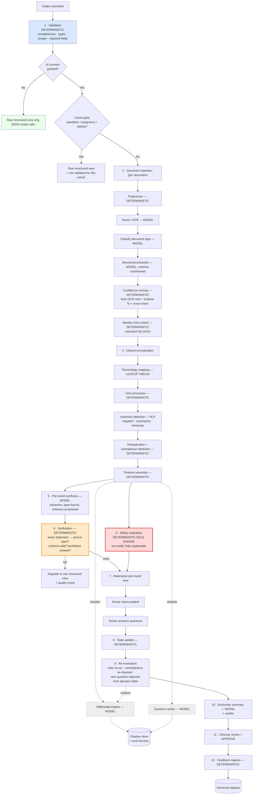
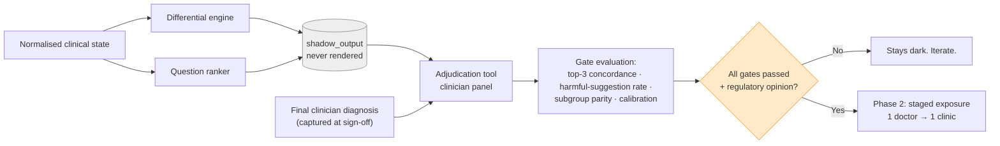
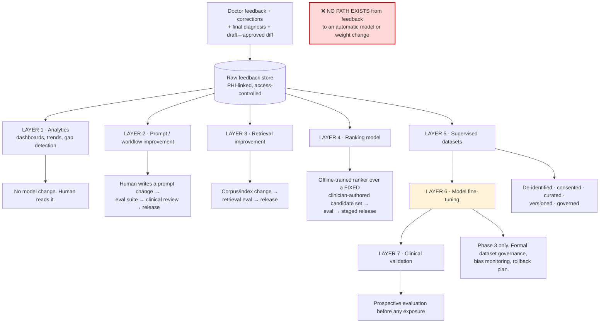

# Deliverable 8 — AI Architecture

**Design stance:** the AI layer is a **fixed, auditable pipeline of narrow steps**, not an agent. Control flow is deterministic. Each model call has a defined input schema, a defined output schema, a version pin, and a validator. Anything a rule, formula or lookup can do is not given to a model.

---

## 1. The AI processing pipeline



## 2. Deterministic vs model — the explicit boundary

**Rule:** *a model is used only where the task is genuinely one of language or perception, and where a wrong answer is caught downstream by a human or a verifier.*

### Deterministic (code) — a model must never be used here

| Task | Why deterministic |
|---|---|
| Authentication, authorisation, tenancy | Security must be provable |
| Token issuance and queue ordering | Fairness and predictability; a "creative" queue is a clinic-operations incident |
| Field validation, type and range checks | Cheap, exact, testable |
| **Red-flag rule evaluation** | Safety-critical; must be readable and signable by a physician; must produce identical output for identical input, forever |
| Unit conversion, dose arithmetic, BMI, eGFR, and any **approved clinical score** | An approved formula exists; a model would be strictly worse and unaccountable |
| Age/cohort determination and gating | Must be exact |
| Deduplication and contradiction detection | Comparison logic |
| Timeline ordering | Date arithmetic |
| Confidence-threshold decisions | Policy, not judgement |
| Consent enforcement | Must be provable |
| Retention, deletion, export eligibility | Compliance logic |
| Audit writing | Cannot be skippable |
| **Question branching in v1** | A clinician-authored decision table; the doctor can read exactly why they were asked something |

### Model-assisted — always with a schema and a verifier

| Task | Model role | Safety net |
|---|---|---|
| OCR | Perception | Per-fact confidence; human confirmation for high-risk fields; source always retained |
| Document classification | Classification | Low confidence → `UNKNOWN` type, generic extraction, flagged |
| Structured extraction | Language → schema | Strict JSON schema; span attribution mandatory; high-risk fields `UNCONFIRMED` |
| Assertion detection | NLP (medspaCy, rules-based) | Deterministic ConText algorithm; explainable |
| **Pre-round synthesis** | Extractive summarisation | **Traceability verifier** rejects any statement without a source span; degrade-to-raw on failure |
| Encounter summary | Assembly + phrasing | Same verifier; clinician approval required |
| *(Shadow)* Differential considerations | Hypothesis generation | Not rendered; adjudicated offline |
| *(Shadow)* Question ranking | Ranking over a fixed candidate set | Cannot invent a question — it can only reorder clinician-authored ones |

**Note the asymmetry deliberately built in:** the model can *select*, *extract* and *phrase*. It cannot *decide*, *invent a question*, or *fire a safety rule*.

## 3. Model call contract

Every model call in the system obeys this contract. No exceptions, enforced by the model gateway.

```python
@dataclass(frozen=True)
class ModelCall:
    task: str                    # "extract_medications" | "synthesise_preround" | ...
    prompt_version: str          # "extract_medications@2026-08-01.3"
    model_id: str                # provider + model + version, pinned
    input_schema: type           # pydantic model
    output_schema: type          # pydantic model — strict, no extra fields
    max_tokens: int
    temperature: float           # 0.0 for extraction; ≤0.2 for synthesis
    timeout_s: float
    retry_policy: RetryPolicy    # bounded; failure is surfaced, never hidden
    deid_required: bool = True   # ALWAYS true for anything derived from patient data
    fallback: Fallback           # what happens on failure — never "make something up"
```

Every call persists an `AIOutput` row: task, model id, model version, prompt version, content-bank version, input hash, output, token counts, latency, verifier result, and the encounter it belongs to. **This is what makes clinical validation and incident reconstruction possible.** Without it, "which version said that?" is unanswerable, and an unanswerable question in a clinical system is a governance failure.

## 4. Prompt design principles

1. **Extract, do not generate.** *"Using only the text provided, list medications. Do not infer. If a field is not present, return null."*
2. **Span attribution is mandatory.** Every extracted item returns the character offsets or bounding box it came from. Items without a span are rejected by the verifier.
3. **"I don't know" is a valid, expected, rewarded output.** Prompts explicitly enumerate `null`, `unknown` and `illegible` as correct answers.
4. **Strict JSON schema, `additionalProperties: false`**, with constrained decoding where the provider supports it.
5. **No clinical conclusions in any prompt's task definition.** The synthesis prompt is asked to *organise*, never to *assess*.
6. **Prompts are versioned files in the repository, reviewed like code, and pinned in every call.** A prompt change is a release that re-triggers the evaluation suite. 🩺
7. **Few-shot examples are drawn from synthetic or consented de-identified cases only**, and are reviewed by the clinical safety owner.
8. **Prompt injection defence:** patient free text and OCR output are untrusted input. They are delimited, never concatenated into instructions, and the output schema constrains what any injected instruction could achieve. The verifier is the backstop — injected content cannot produce a statement with a valid source span that also passes prohibited-content checks.

## 5. The guardrail layer

Four independent checks, in order. Any failure degrades; none is bypassable.

| # | Guardrail | Checks | On failure |
|---|---|---|---|
| **G1** | **Schema validation** | Output parses; conforms exactly; no extra fields; enums valid | Retry once, then degrade |
| **G2** | **Traceability verifier** | *Every* clinical statement maps to a source span in the input; spans exist; quoted text matches | Degrade to raw structured view + quality event |
| **G3** | **Prohibited content** | No diagnosis language; no treatment recommendation; no reassurance phrasing; no confidence words outside defined bands; no patient-directed content | Strip or degrade + quality event |
| **G4** | **Consistency** | Summary does not contradict the structured record; negated findings not asserted as positive; no medication absent from the medication list | Degrade + quality event |

**G2 is the anti-hallucination mechanism, and it is deterministic.** It does not ask a model whether the output is faithful; it checks whether each statement points at text that exists. This is the difference between a safety control and a hope.

**G3's prohibited-language list is authored by the clinical safety owner**, not by engineering, and is versioned with the content pack.

## 6. Shadow mode



**Why this is the right call and not timidity:** shadow mode gives us (a) the full labelled dataset — every shadow output paired with the doctor's actual diagnosis, (b) real-distribution evaluation rather than benchmark evaluation, (c) zero clinical risk during the period when quality is least known, and (d) a defensible regulatory narrative — *we validated before we deployed*, which is exactly what a regulator wants to hear. The engineering cost of building it dark is near-identical to building it visible.

**Enforced how:** shadow outputs are written to a separate table with no API route reachable by a `DOCTOR` role. This is an authorisation rule and a CI test, not a UI decision.

## 7. Feedback and learning architecture

**The governing constraint from the brief, restated:** feedback must improve the product **without allowing uncontrolled model self-training from individual doctor feedback.** The architecture below makes that structurally impossible, not merely discouraged.



### The seven layers, and what governs each

| Layer | What changes | Who approves | Cadence | Rollback |
|---|---|---|---|---|
| **1 · Analytics** | Nothing automatic — humans learn where the gaps are | — | Continuous | N/A |
| **2 · Prompt / workflow** | Prompt text, pipeline steps, UI copy | Eng lead + clinical safety owner | Per release | Prompt version pin — revert is a config change |
| **3 · Retrieval** | Corpus contents, chunking, index parameters | Eng lead + clinical safety owner | Per release | Index version |
| **4 · Ranking model** | An offline-trained ranker choosing **among clinician-authored questions only** | Eng lead + clinical safety owner + gate evaluation | Monthly at most | Model version pin; instant revert to the deterministic order |
| **5 · Supervised datasets** | Curated, de-identified, consented training/eval sets | **Data governance board** (clinical + privacy + eng) | Quarterly | Dataset version |
| **6 · Fine-tuning** | Model weights | Data governance board + external clinical review | **Phase 3 only** | Model version pin; canary; instant revert |
| **7 · Clinical validation** | Permission to expose anything from 4–6 | Clinical safety owner + prospective evaluation | Per change | Feature flag |

### Structural safeguards

1. **No online learning. No RLHF from production. No automatic retraining.** There is no code path from a feedback row to a model artefact. This is verified by architecture review, not by policy alone.
2. **Individual feedback is never a label on its own.** A single doctor's "irrelevant" is an opinion. Labels for datasets require **either** clinician-panel adjudication **or** an objective outcome (the final diagnosis), and inter-rater agreement is reported alongside.
3. **Dataset governance:** every dataset has a version, a lineage record, a consent basis, an inclusion/exclusion policy, a de-identification method, an approver and an expiry.
4. **Bias monitoring is mandatory at every gate:** performance stratified by language, age band, sex, entry mode and site. A model that improves overall while degrading for staff-assisted (i.e. lower-literacy) patients **fails the gate**. 🩺
5. **Versioning and rollback:** every deployed artefact — prompt, index, ranker, model, content pack — is version-pinned, recorded on every output, and revertible in one action.
6. **Safety evaluation before every release**, on a fixed adversarial suite that includes red-flag cases, contradictory documents, edge cohorts, prompt-injection attempts, and known past failures. **The suite only grows.**
7. **Feedback cannot alter the red-flag rules.** Rules change only by clinician authorship and two-person sign-off. No amount of "not useful" ratings silently retires a safety rule — though a persistently low acceptance rate raises a review task for the clinical safety owner, who decides. 🩺

## 8. Model selection strategy

| Task | Model class | Rationale |
|---|---|---|
| OCR | Specialist OCR (PaddleOCR) + commercial fallback | General LLMs are poor and expensive at dense OCR; Indic script coverage is the deciding factor |
| Classification | Small/fast model or a fine-tuned classifier later | High volume, simple task, cost-sensitive |
| Extraction | Mid-tier LLM, temperature 0, constrained decoding | Accuracy matters; volume is moderate |
| Synthesis | Higher-capability LLM, low temperature | Quality of organisation is the product |
| Assertion detection | medspaCy (not an LLM) | Deterministic, explainable, free, sufficient |
| Shadow differential | Higher-capability LLM | Quality ceiling matters for evaluating feasibility |

**Provider abstraction is mandatory.** The model gateway exposes one interface; providers are configuration. This exists for three reasons that will all become real: data-residency requirements may force a change; pricing will change; and an in-region open-weights deployment may become necessary. **[Inference]**

## 9. Cost and latency controls

- **Tiered processing.** Digital-text documents skip OCR entirely (large saving). Cheap classification gates expensive extraction.
- **Caching.** Identical document hashes are never re-processed. Content-bank retrievals are cached.
- **Budget caps per encounter.** An encounter exceeding a token/page budget stops, processes what it can, and flags for staff attention rather than silently costing 50× the median.
- **Batch where possible.** Shadow-mode work runs off-peak.
- **Token accounting per encounter, per tenant, per task**, surfaced in observability so cost regressions are caught in days, not at the invoice.
- **The doctor's path is never on a model call**, so model latency never becomes user latency.

## 10. What we explicitly do not build

Autonomous agents · tool-calling loops with unbounded steps · free-form clinician chat over the record · model-generated safety rules · model-generated questions in v1 · patient-facing generation of any kind · online learning · automatic retraining · any model whose version cannot be pinned and recorded.

## v2.2 Reconciliation

There is no autonomous clinical agent loop. Model output contracts require source spans, assertion strength, provenance, reliability, verification status, temporal status, and fallback state. MEDOXZI never self-trains in production: live interactions produce candidate learning data that must pass offline analysis, evaluation, clinical review when material, versioned release, and rollback.

