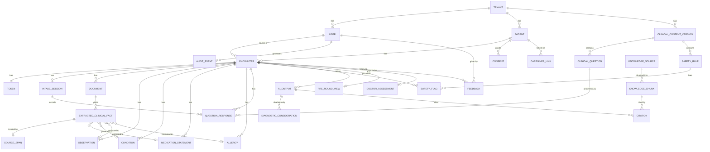

# Deliverable 9 — Data Model

**Design principles enforced by this schema:**
1. **Provenance is a column, not a convention.** Every clinical value knows who asserted it.
2. **AI output is physically separate from the clinical record.** Promotion requires a human actor and creates an audit event.
3. **`tenant_id` on every table, with row-level security.** Isolation the application cannot forget.
4. **Append-only where it matters.** Audit and AI outputs are never updated or deleted in place.
5. **Absence, negation and ignorance are distinct values.** `NOT_ASKED` ≠ `UNKNOWN` ≠ `NONE_KNOWN` ≠ `NO`.

---

## 1. Entity relationship overview



## 2. Core entities

### Tenant, User, Patient

| `tenant` | |
|---|---|
| `id` uuid PK · `name` · `region` · `locale_default` · `retention_policy` jsonb · `active_content_version_id` · `settings` jsonb · `created_at` |

| `user` | |
|---|---|
| `id` uuid PK · `tenant_id` FK · `role` enum(PATIENT, CAREGIVER, FRONT_DESK, INTAKE_STAFF, NURSE, DOCTOR, CLINICAL_SAFETY_OWNER, CLINIC_ADMIN, SUPPORT) · `display_name` · `auth_subject` · `licence_number` (doctors) · `specialty` · `is_active` · `mfa_enabled` · `created_at` |

| `patient` | |
|---|---|
| `id` uuid PK · `tenant_id` FK · `mrn` · `external_id` (e.g. ABHA) · `name_encrypted` · `dob` · `dob_precision` enum(DAY,MONTH,YEAR,AGE_ONLY) · `sex` · `gender` · `contact_encrypted` · `preferred_language` · `is_merged_into` FK · `created_at` |

*Direct identifiers are stored in application-level-encrypted columns and are never included in any payload leaving the trust boundary.*

| `caregiver_link` | |
|---|---|
| `id` · `tenant_id` · `patient_id` · `caregiver_user_id` · `relationship` · `consent_id` FK · `valid_from` · `valid_to` · `revoked_at` |

| `consent` | |
|---|---|
| `id` · `tenant_id` · `patient_id` · `type` enum(TREATMENT, AI_PROCESSING, PRODUCT_IMPROVEMENT, CAREGIVER_REPRESENTATION, GUARDIAN) · `granted` bool · `granted_at` · `revoked_at` · `consent_text_version` · `language_shown` · `captured_by_user_id` · `capture_method` enum(APP, STAFF, PAPER_SCAN) |

*Consent rows are immutable; revocation is a new row, not an update.*

### Encounter and Token

| `encounter` | |
|---|---|
| `id` uuid PK · `tenant_id` · `patient_id` · `doctor_user_id` · `session_date` · `department` · `status` enum(CREATED, INTAKE_PENDING, INTAKE_PARTIAL, INTAKE_COMPLETE, PROCESSING, READY, IN_CONSULT, **SIGNED**, CANCELLED) · `cohort_flags` jsonb (paediatric/pregnancy/elderly) · `ai_enabled` bool *(derived from consent)* · `content_version_id` · `created_at` · `signed_at` · `signed_by_user_id` |

**Constraint:** `status = 'SIGNED'` requires `signed_by_user_id` to reference a user with `role = 'DOCTOR'`. Enforced by a trigger, not by application code.

| `token` | |
|---|---|
| `id` · `tenant_id` · `encounter_id` UNIQUE · `number` · `session_id` · `issued_at` · `called_at` · `queue_position` · `priority_hint` · `priority_hint_reason` |

### Intake

| `intake_session` | |
|---|---|
| `id` · `tenant_id` · `encounter_id` · `mode` enum(PATIENT_SELF, CAREGIVER, STAFF) · `actor_user_id` · `language` · `content_version_id` · `started_at` · `submitted_at` · `sections_completed` int · `sections_total` int · `abandoned_at_question_id` |

| `question_response` | |
|---|---|
| `id` · `tenant_id` · `encounter_id` · `intake_session_id` (nullable — doctor answers have none) · `clinical_question_id` FK · `answer_type` enum(BOOL, ENUM, MULTI, NUMERIC, TEXT, DATE) · `value_bool` · `value_enum` · `value_multi` text[] · `value_numeric` · `value_unit` · `value_text` · `value_text_original_language` · `status` enum(ANSWERED, **NOT_ASKED**, **UNKNOWN**, SKIPPED, DECLINED, **UNABLE_TO_ANSWER**) · `entered_by` enum(PATIENT, CAREGIVER, STAFF, DOCTOR, NURSE, AI, IMPORT) · `actor_user_id` · `answered_at` · `superseded_by_id` |

**`status` is the most safety-relevant enum in the schema.** `NOT_ASKED`, `UNKNOWN` and a `false` answer are three different clinical facts and are never collapsed in storage, in the API, or in the UI.

**`UNABLE_TO_ANSWER`** (added in v2.1) means the patient *could not* answer — confusion, distress, language barrier, hearing difficulty, too unwell. It is the only non-answer state that is a **signal about the patient rather than about the question**, and a cluster of them in one encounter is itself worth showing to the doctor. `PATIENT_UNSURE` was deliberately **not** added: its clinical consequence is identical to `UNKNOWN`, and every additional state is a state someone can collapse incorrectly. See [External-Review-Reconciliation](../00-Executive/External-Review-Reconciliation.md) §6.

### Documents and extraction

| `document` | |
|---|---|
| `id` · `tenant_id` · `encounter_id` · `patient_id` · `storage_key` · `content_hash` · `mime_type` · `page_count` · `uploaded_by_user_id` · `upload_mode` enum(PATIENT, STAFF, IMPORT) · `doc_type` enum(PRESCRIPTION, LAB_REPORT, RADIOLOGY_REPORT, DISCHARGE_SUMMARY, CONSULT_NOTE, MEDICATION_LIST, OTHER, UNKNOWN) · `doc_type_confidence` · `is_handwritten` bool · `document_date` · `identity_check` enum(MATCH, MISMATCH, NOT_CHECKABLE) · `processing_status` enum(QUEUED, PROCESSING, COMPLETE, **EXTRACTION_FAILED**, BLOCKED_IDENTITY) · `created_at` |

| `source_span` | |
|---|---|
| `id` · `tenant_id` · `document_id` · `page` · `bbox` jsonb · `char_start` · `char_end` · `text_excerpt` |

| `extracted_clinical_fact` | |
|---|---|
| `id` · `tenant_id` · `encounter_id` · `document_id` · `source_span_id` · `fact_type` enum(MEDICATION, CONDITION, LAB_RESULT, ALLERGY, PROCEDURE, VITAL, DATE, OTHER) · `raw_text` · `normalised_value` jsonb · `code_system` · `code` · `unit` · `reference_range` · `observed_date` · `confidence` numeric(3,2) · `is_high_risk` bool · `verification_status` enum(**UNCONFIRMED**, CONFIRMED, CORRECTED, REJECTED, ILLEGIBLE) · `verified_by_user_id` · `verified_at` · `corrected_value` jsonb · `duplicate_of_id` · `contradicts_ids` uuid[] · `model_id` · `model_version` · `created_at` |

**Constraint:** `is_high_risk = true AND verification_status = 'CONFIRMED'` requires `verified_by_user_id IS NOT NULL`. **This is the single most important constraint in the schema** — it makes it physically impossible for an OCR-derived medication or allergy to enter the record unverified.

### Clinical record (only reachable via human promotion)

| `observation` | `condition` | `medication_statement` | `allergy` |
|---|---|---|---|
| Shared columns: `id` · `tenant_id` · `encounter_id` · `patient_id` · `code_system` · `code` · `display` · `status` · **`provenance` enum(PATIENT_REPORTED, CAREGIVER_REPORTED, STAFF_RECORDED, DOCTOR_ASSERTED, RECORD_IMPORTED, AI_EXTRACTED_CONFIRMED)** · `source_fact_id` FK → extracted_clinical_fact · `asserted_by_user_id` · `asserted_at` · `is_negated` bool · `certainty` enum(CONFIRMED, SUSPECTED, REFUTED, UNKNOWN) |
| `observation` adds: `value_numeric` · `value_text` · `unit` · `reference_range` · `effective_date` · `abnormal_flag` |
| `condition` adds: `onset_date` · `clinical_status` · `is_comorbidity` |
| `medication_statement` adds: `drug_generic` · `drug_brand` · `dose` · `dose_unit` · `frequency` · `route` · `start_date` · `end_date` · `is_current` |
| `allergy` adds: `substance` · `reaction` · `severity` · `status` enum(ACTIVE, RESOLVED, **NONE_KNOWN**, **NOT_ASKED**) |

*`provenance` is `NOT NULL` on all four. There is no path to insert a clinical row without stating where it came from.*

### Clinical concepts (language-independent)

| `clinical_concept` | |
|---|---|
| `code` PK text — e.g. `SYMPTOM_DYSPNEA` · `tenant_id` (nullable = global) · `category` enum(SYMPTOM, FINDING, CONDITION, DRUG_CLASS, ANALYTE, OTHER) · `render_by_locale` jsonb · `patient_variants_by_locale` jsonb · `icd10` · `snomed` · `loinc` (all nullable) · `content_version_id` · `reviewed_by_user_id` |

**Constraint:** clinical values that reference a concept do so by `code`, never by rendered text. A migration that introduces a text-keyed clinical reference fails review.

`question_response`, `observation`, `condition` and `allergy` each gain a nullable `concept_code` FK. Nullable because a free-text answer that could not be confidently mapped **stays unmapped and is shown to the doctor verbatim** — force-fitting is worse than leaving it typed as text.

### Clinical content (versioned, clinician-owned)

| `clinical_content_version` | |
|---|---|
| `id` · `tenant_id` (nullable = global) · `version` · `status` enum(DRAFT, IN_REVIEW, **ACTIVE**, RETIRED) · `authored_by_user_id` · `signed_by_user_id` · `signed_at` · `activated_by_user_id` · `activated_at` · `changelog` · `parent_version_id` |

**Constraint:** `authored_by_user_id != activated_by_user_id` for versions containing safety rules — two-person control.

| `clinical_question` | |
|---|---|
| `id` · `content_version_id` · `chief_complaint_code` · `question_key` · `text_by_language` jsonb · `answer_type` · `options` jsonb · `unit` · `branching_rule` jsonb *(decision table)* · `is_red_flag_screen` bool · `is_required_for_completeness` bool · `display_order` · `clinical_rationale` |

| `safety_rule` | |
|---|---|
| `id` · `content_version_id` · `rule_key` · `chief_complaint_scope` text[] · `cohort_scope` jsonb · `expression` jsonb *(deterministic AST over structured fields)* · `severity` enum(HIGH, MEDIUM, LOW) · `message_template` · `suggested_action` · `clinical_rationale` · `evidence_reference` · `authored_by_user_id` · `active` bool |

**`expression` is a declarative AST, not code.** It is evaluated by a small deterministic interpreter, it is human-readable, it can be rendered back to a clinician as a sentence, and it can be unit-tested. No `eval`, no embedded scripting, no model.

| `safety_flag` | |
|---|---|
| `id` · `tenant_id` · `encounter_id` · `safety_rule_id` · `rule_version` · `severity` · `fired_at` · `input_snapshot` jsonb *(exact values that triggered it)* · `acknowledged_by_user_id` · `acknowledged_at` · `staff_assessment` · `clinician_rating` enum(APPROPRIATE, NOT_APPROPRIATE, UNSURE) · `action_taken` |

### AI outputs (separate, append-only, never the clinical record)

| `ai_output` | |
|---|---|
| `id` · `tenant_id` · `encounter_id` · `task` · `model_id` · `model_version` · `prompt_version` · `content_version_id` · `input_hash` · `output` jsonb · `verifier_result` enum(PASS, FAIL_SCHEMA, FAIL_TRACEABILITY, FAIL_CONTENT, FAIL_CONSISTENCY) · `verifier_detail` jsonb · `is_shadow` bool · `input_tokens` · `output_tokens` · `latency_ms` · `cost_estimate` · `created_at` |

*Append-only. No update path exists.*

| `pre_round_view` | |
|---|---|
| `id` · `tenant_id` · `encounter_id` UNIQUE · `content` jsonb *(the materialised one-screen structure, every element carrying provenance, reliability, verification status, temporal status, and optional source_span_id)* · `generation_mode` enum(RAW_ONLY, STRUCTURED_ONLY, SOURCE_BOUND_SUMMARY, PARTIAL_DOCUMENT_MODE, AI_DISABLED_BY_CONSENT, AI_DISABLED_BY_COHORT, AI_FAILED_SAFE, FULL_PRE_ROUND) · `ai_output_id` · `built_at` · `is_stale` bool |

| `diagnostic_consideration` | |
|---|---|
| `id` · `tenant_id` · `encounter_id` · `ai_output_id` · **`is_shadow` bool DEFAULT true** · `label` · `rank` · `supporting_evidence` jsonb *(each with source_span_id)* · `contradicting_evidence` jsonb · `missing_information` jsonb · `discriminating_questions` jsonb · `evidence_strength` enum(LOW, MODERATE, HIGH) · `citation_ids` uuid[] |

**In v1 there is no API route that returns rows where `is_shadow = true` to a `DOCTOR` role.** Enforced in the authorisation layer and tested in CI.

| `citation` | |
|---|---|
| `id` · `tenant_id` · `ai_output_id` · `knowledge_chunk_id` · `source_title` · `source_type` · `publisher` · `publication_date` · `version` · `page` · `excerpt` · `relevance_score` · `is_potentially_outdated` bool · `staleness_reason` |

### Assessment and feedback

| `doctor_assessment` | |
|---|---|
| `id` · `tenant_id` · `encounter_id` UNIQUE · `doctor_user_id` · `final_diagnosis_text` · `final_diagnosis_code` · `code_system` · `alternative_diagnosis_text` · `plan_text` · `draft_note_ai_output_id` · `approved_note` text · `edit_diff` jsonb · `approved_at` |

| `feedback` | |
|---|---|
| `id` · `tenant_id` · `encounter_id` · `user_id` · `target_type` enum(QUESTION, CONSIDERATION, SUMMARY, EXTRACTION, RED_FLAG) · `target_id` · `rating` enum(USEFUL, NOT_USEFUL, INCORRECT, REDUNDANT, MISSING_IMPORTANT, RELEVANT, IRRELEVANT, ALREADY_OBVIOUS, ACCURATE, PARTIALLY_ACCURATE, **CLINICALLY_UNSAFE**, OMITTED_IMPORTANT) · `comment` · `created_at` |

**A `CLINICALLY_UNSAFE` rating creates a `safety_event` row by trigger.** Not by application code that could be forgotten.

| `safety_event` | |
|---|---|
| `id` · `tenant_id` · `encounter_id` · `feedback_id` · `severity` · `reported_at` · `assigned_to_user_id` · `root_cause` · `action_taken` · `closed_at` |

### Knowledge and audit

| `knowledge_source` | |
|---|---|
| `id` · `tenant_id` (nullable = global) · `title` · `source_type` · `publisher` · `publication_date` · `version` · `review_date` · **`licence_ref` NOT NULL** · **`approved_by_user_id` NOT NULL** · `access_scope` · `storage_key` · `ingested_at` |

| `knowledge_chunk` | |
|---|---|
| `id` · `tenant_id` · `knowledge_source_id` · `chunk_index` · `heading_path` · `text` · `embedding` vector(N) · `tsv` tsvector · `page` · `char_start` · `char_end` · `metadata` jsonb |

| `audit_event` | |
|---|---|
| `id` bigserial · `tenant_id` · `occurred_at` · `actor_user_id` · `actor_role` · `action` · `resource_type` · `resource_id` · `patient_id` · `encounter_id` · `outcome` enum(SUCCESS, DENIED, ERROR) · `reason` *(required for break-glass and out-of-queue access)* · `ip_hash` · `user_agent_hash` · `before_value` jsonb · `after_value` jsonb · `request_id` |

**Append-only.** No `UPDATE` or `DELETE` grant exists on this table for the application role. Periodically exported to WORM storage.

## 3. Key constraints, expressed as SQL

```sql
-- Only a doctor can sign an encounter
CREATE OR REPLACE FUNCTION enforce_doctor_signature() RETURNS trigger AS $$
BEGIN
  IF NEW.status = 'SIGNED' THEN
    IF NEW.signed_by_user_id IS NULL
       OR NOT EXISTS (SELECT 1 FROM "user"
                      WHERE id = NEW.signed_by_user_id
                        AND role = 'DOCTOR'
                        AND tenant_id = NEW.tenant_id) THEN
      RAISE EXCEPTION 'Encounter can only be signed by a DOCTOR of the same tenant';
    END IF;
  END IF;
  RETURN NEW;
END $$ LANGUAGE plpgsql;

-- High-risk extracted facts require a human verifier
ALTER TABLE extracted_clinical_fact
  ADD CONSTRAINT high_risk_requires_human_verification
  CHECK (
    NOT (is_high_risk AND verification_status = 'CONFIRMED'
         AND verified_by_user_id IS NULL)
  );

-- Clinical rows must declare provenance
ALTER TABLE medication_statement ALTER COLUMN provenance SET NOT NULL;
ALTER TABLE allergy             ALTER COLUMN provenance SET NOT NULL;
ALTER TABLE condition           ALTER COLUMN provenance SET NOT NULL;
ALTER TABLE observation         ALTER COLUMN provenance SET NOT NULL;

-- Knowledge cannot be ingested without a licence and an approver
ALTER TABLE knowledge_source ALTER COLUMN licence_ref        SET NOT NULL;
ALTER TABLE knowledge_source ALTER COLUMN approved_by_user_id SET NOT NULL;

-- Two-person control for safety content
ALTER TABLE clinical_content_version
  ADD CONSTRAINT two_person_activation
  CHECK (activated_by_user_id IS NULL
         OR activated_by_user_id <> authored_by_user_id);

-- Tenant isolation, on every table
ALTER TABLE encounter ENABLE ROW LEVEL SECURITY;
CREATE POLICY tenant_isolation ON encounter
  USING (tenant_id = current_setting('app.tenant_id')::uuid);
-- ... repeated for every tenant-scoped table, generated and verified in CI
```

## 4. Indexing notes

| Index | Purpose |
|---|---|
| `encounter (tenant_id, session_date, status)` | Queue view |
| `encounter (tenant_id, doctor_user_id, session_date)` | Doctor's list |
| `pre_round_view (encounter_id)` unique | The doctor's single hot read |
| `extracted_clinical_fact (encounter_id, fact_type, verification_status)` | Verification workflow |
| `document (content_hash)` | Duplicate detection and reprocessing avoidance |
| `audit_event (tenant_id, occurred_at DESC)`, partitioned monthly | Audit queries and retention |
| `knowledge_chunk USING hnsw (embedding vector_cosine_ops)` | Vector retrieval |
| `knowledge_chunk USING gin (tsv)` | Keyword retrieval |
| `ai_output (encounter_id, task, created_at DESC)` | Debugging and evaluation |

## 5. Retention and deletion

| Data | Retention | Deletion behaviour |
|---|---|---|
| Approved clinical record | Per clinic policy / statutory minimum ⚖️ | Deleted only per policy, with audit |
| Raw uploaded documents | 90 days hot → archive tier | Deleted with the patient record |
| `extracted_clinical_fact` | With the encounter | Cascades from document deletion |
| `ai_output`, `pre_round_view` | 30 days unless retained for evaluation with consent | **Deleted when the source is deleted — derived data does not outlive its source** |
| Shadow outputs | Retained for evaluation **only under product-improvement consent** | Deleted on consent withdrawal |
| `audit_event` | 7 years (target — confirm against Indian requirements ⚖️) | Never deleted within the retention window |
| Analytics store | De-identified only | Re-derived from source; consent withdrawal removes at the next build |

**Deletion is a workflow, not a `DELETE`.** It enumerates every derived artefact — documents, extracted facts, AI outputs, shadow outputs, cache entries, analytics rows — and produces a completion record. Tested as part of MVP acceptance.

## v2.2 Reconciliation

Add first-class fields/entities for provenance, source reliability, clinician verification, temporal status, contradictions, document lifecycle, identity binding, content/source versioning, signed rule activation, idempotency, optimistic locking, immutable events, label taxonomy, and shadow isolation. `GROUND_TRUTH` is not a valid default for doctor diagnoses.

