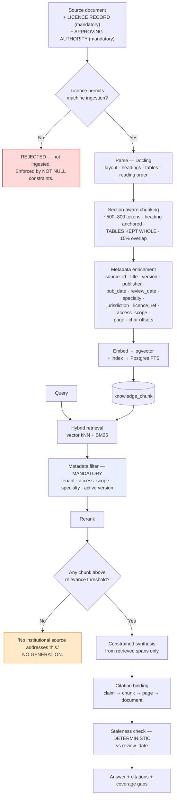

# RAG Architecture

**Scope:** retrieval over **institution-approved knowledge** and over the system's own clinical content. Published-literature retrieval is out of scope — see [Literature-Research.md](../01-Research/Literature-Research.md) for why.

**MVP position:** retrieval is used for a **narrow, low-risk purpose only** — surfacing the clinic's own protocol text alongside a fired red-flag rule, and retrieving question-bank content. Clinician-facing knowledge Q&A is Phase 2.

---

## 1. Why RAG and not fine-tuning (decision record)

| Criterion | RAG | Fine-tuning |
|---|---|---|
| Content updates | Re-index, minutes | Retrain, weeks |
| Citations | Native — the retrieved chunk *is* the citation | None; the model cannot cite what it absorbed |
| Copyright/licensing | Content is *retrieved*, not absorbed into weights; licence scope is enforceable per source | Content is baked into weights — a licensing problem, and an **unlearnable** one ⚖️ |
| Per-tenant access control | Enforceable at retrieval time | Impossible once trained |
| Auditability | "This answer came from document X page 14" | "The model knows it somehow" |
| Cost to change | Low | High |
| Verdict | ✅ **Chosen** | ❌ Rejected for knowledge content |

**Recorded as ADR-004.** The copyright point alone is decisive: fine-tuning on licensed textbooks would embed copyrighted content in a distributable artefact, which is both a licence breach risk and irreversible.

## 2. Pipeline

## 3. Non-negotiable rules

1. **No licence record, no ingestion.** `KnowledgeSource.licence_ref` and `approved_by` are `NOT NULL`. ⚖️
2. **Tenant + access scope filtering happens *inside* the retrieval query**, never as a post-filter. A post-filter bug is a cross-tenant data breach. 🔐
3. **Empty retrieval produces an explicit "no source addresses this", never a generated answer.** The model's parametric knowledge is not a fallback — it is precisely what we are trying to exclude.
4. **Tables are never split.** Splitting a dosing table is a patient-safety defect.
5. **Every claim carries a citation resolving to a highlighted region of the original.**
6. **Staleness is computed, not judged** — from the source's stated review date, and shown in the UI.
7. **Retrieval never feeds the red-flag engine.** Safety rules read structured fields only.

## 4. Chunking strategy

| Document type | Strategy |
|---|---|
| Protocols / SOPs | Section-aware; each numbered section is a chunk; headings prepended to chunk text for retrieval context |
| Guidelines | Recommendation-level chunks; recommendation grade and evidence level preserved as metadata |
| Formulary / dosing tables | **Whole table as one chunk**, plus a structured extraction into a deterministic lookup table — *the structured table is what the system actually uses; the chunk is for display* |
| Textbooks (licensed) | Section-aware with heading hierarchy retained |
| Our own question banks | One chunk per question group |

## 5. Retrieval quality evaluation

| Metric | Target | Method |
|---|---|---|
| Recall@5 on a clinician-authored query set | ≥90% | Fixed evaluation set, re-run on every index change |
| Citation correctness | 100% — every citation resolves to text that supports the claim | Adjudicated sample |
| Empty-retrieval honesty | 100% — no generated answer when retrieval is empty | Adversarial test set of out-of-corpus questions |
| Cross-tenant leakage | **0** | Automated test suite with multi-tenant fixtures, run in CI |
| Staleness flagging | 100% of past-review-date sources flagged | Deterministic check |

## 6. Why not a dedicated vector database (yet)

At MVP corpus size — institutional protocols, question banks, a formulary, a few thousand documents — the corpus is comfortably within pgvector's HNSW performance envelope. Adding Qdrant/Weaviate/Milvus would mean a second stateful system with its own backup, encryption, RBAC, audit and residency story, all of which must be brought to healthcare standard. **The operational and compliance cost exceeds the retrieval benefit at this scale.** Revisit at >1–5M chunks or when a genuine latency problem is measured — not before. **[Inference]** Recorded as ADR-005.

## v2.2 Reconciliation

Clinical retrieval is from approved internal knowledge stores only, never unrestricted literature QA in the clinical path. Every source records title, publisher, author/organisation, version/date, URL/reference, licence status, permitted reuse, copy/paraphrase/independent-structure mode, and evidence class. Clinical correctness and copyright/licensing are separate controls.

