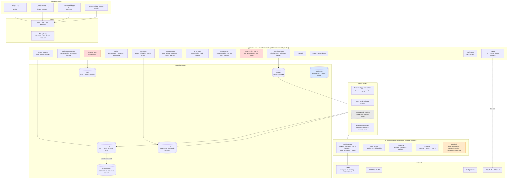
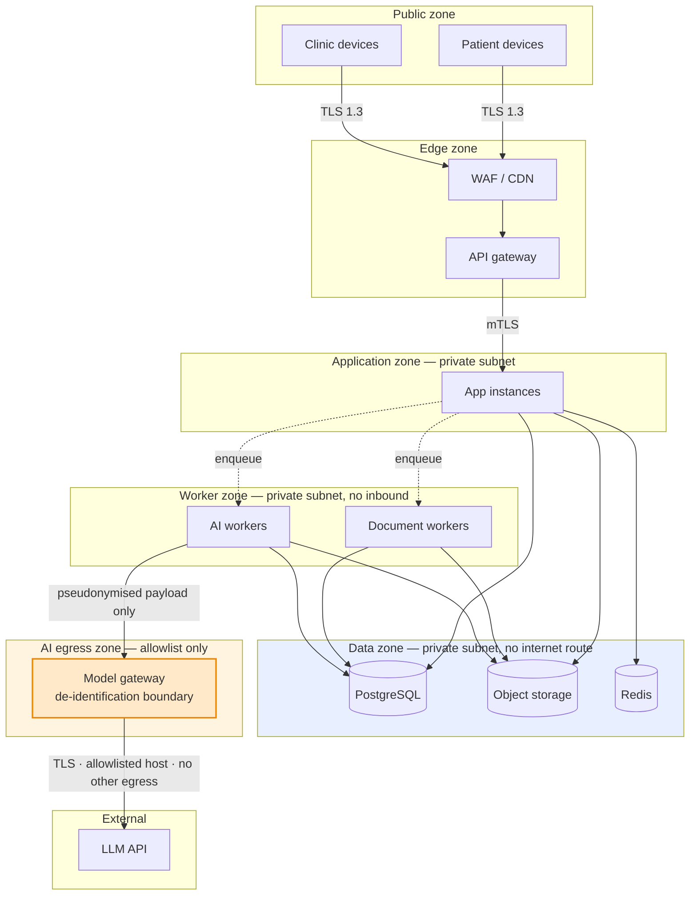

# Deliverable 7 — System Architecture

**Architectural stance:** a **modular monolith** with clean internal seams, one Postgres, one object store, and an async worker pool. Microservices are rejected for the MVP — they would buy distributed-systems problems and no benefit at 50 concurrent users, while making the audit trail and transactional integrity of a clinical record harder to guarantee. The module boundaries below are drawn where extraction *would later be cheap*.

---

## 1. Overall system architecture



## 2. Client applications

| Client | Tech | Key constraints |
|---|---|---|
| **Patient PWA** | React + TypeScript, PWA (installable, no app store) | Works on low-end Android; large touch targets; local draft persistence via IndexedDB; resumable uploads; **renders no clinical interpretation, enforced by the API refusing to serve AI resources to patient tokens** |
| **Staff console** | Same React codebase, different route bundle | Fast registration (≤6 fields); multi-page camera capture; read-back flow; works on a shared tablet with device binding |
| **Doctor dashboard** | React + TypeScript, desktop-first, tablet-capable | **≤30s read, <1.5s interactive, keyboard-first, no modals.** Data is pre-materialised — the dashboard performs **no** AI calls |
| **Admin + content console** | Same codebase | Content authoring with diff view, versioning, two-person sign-off |

**Shared:** one design system, one API client, one provenance-chip component used everywhere a clinical value is rendered. *The provenance chip being a single shared component is an architectural safety control — it makes "render a fact without provenance" require deliberate effort.*

## 3. Backend modules

| Module | Responsibility | Deterministic? |
|---|---|---|
| **Identity & Access** | Authn, sessions, RBAC, tenant resolution, consent records, break-glass | ✅ fully |
| **Patient & Encounter** | Demographics, identity matching (staff-confirmed), encounter lifecycle state machine | ✅ |
| **Queue & Token** | Token issuance, ordering, session management, status | ✅ **never AI** |
| **Intake** | Serves versioned question sets, records answers with provenance, autosave, resumption, mode handoff | ✅ (branching is a decision table) |
| **Document** | Upload, validation, virus scan, storage, lifecycle, source-span registry, identity cross-check | ✅ orchestration; AI inside workers |
| **Clinical Record** | Observations, conditions, medication statements, allergies; **verification-status state machine** | ✅ |
| **Terminology** | Brand→generic, analyte normalisation, unit conversion, internal code mapping | ✅ lookup tables |
| **Clinical Content** | Question banks, red-flag rules, significant-negative definitions, required-field definitions; versions and sign-off | ✅ |
| **Safety Rules Engine** | Evaluates red-flag rules over structured state; emits explainable results | ✅ **no model, ever** |
| **AI Orchestration** | Fixed pipeline DAG, schema enforcement, verifier invocation, model/prompt version pinning, degrade paths | Control flow deterministic; steps may call models |
| **Feedback** | Ratings, corrections, final diagnosis, safety events | ✅ |
| **Audit** | Append-only event log; no update or delete path exists in code | ✅ |
| **Notification** | SMS intake links, staff alerts | ✅ |
| **Export** | PDF and JSON of approved encounters; refuses drafts | ✅ |

**Why a monolith:** a clinical encounter is a transactional unit. Splitting encounter, intake and clinical record across services means either distributed transactions or eventual consistency in a record a doctor is about to sign. Neither is acceptable at this stage. One database, one transaction, one truth.

## 4. Data infrastructure — and why each piece exists

| Component | Choice | Why it is needed | Why not something else |
|---|---|---|---|
| **Relational DB** | PostgreSQL 16+ | Clinical data is deeply relational; transactional integrity is a safety property; **row-level security gives per-tenant isolation the application cannot forget** | A document store would push referential integrity and tenancy isolation into application code |
| **Vector search** | **pgvector inside the same Postgres** | Retrieval over question banks, protocols and similar-case lookup at MVP corpus size | A dedicated vector DB adds a second stateful system with its own backup, RBAC, encryption and audit story. Revisit at >1–5M chunks |
| **Full-text search** | Postgres FTS | Hybrid retrieval and document search | Same reasoning |
| **Object storage** | S3-compatible, in-region, SSE, versioned, private | Source documents are large, immutable, and must be retained and served with signed short-lived URLs | Storing images in Postgres is an operational mistake |
| **Cache** | Redis | Session data, materialised pre-round views, rate limits, distributed locks (e.g. one pipeline run per encounter) | — |
| **Queue** | Durable broker (Redis Streams / SQS-equivalent / RabbitMQ) | Document and AI work is slow, retryable and must survive restarts; **decoupling is what keeps the doctor's path synchronous-free** | In-process background tasks lose work on deploy |
| **Audit store** | Append-only Postgres table + periodic export to WORM object storage | Tamper-evidence; regulatory expectation; incident reconstruction | Application logs are not an audit trail |
| **Analytics store** | Separate database/account, **de-identified only** | Product metrics and evaluation without touching PHI | Querying the OLTP database for analytics leaks PHI into dashboards |

## 5. Trust boundaries



**The de-identification boundary at the model gateway is the most important line in this diagram.** Nothing crosses it carrying a direct identifier. Names, phone numbers, addresses, MRNs and ABHA identifiers are replaced with stable per-encounter pseudonyms before the payload is constructed; the mapping never leaves our database; the response is re-identified on the way back. This is enforced in one place, tested in CI, and asserted at runtime. See [Privacy.md](../05-Security-Compliance/Privacy.md) §4.

## 6. Deployment topology (MVP)

```
Region: India (ap-south-1 / Central India equivalent) — configurable per tenant

  ├── VPC
  │   ├── Public subnets:  ALB + WAF, NAT
  │   ├── App subnets:     2× app containers (autoscaled 2–6)
  │   ├── Worker subnets:  2× worker containers (autoscaled 2–8; OCR workers separate pool)
  │   └── Data subnets:    Managed Postgres (Multi-AZ), Redis, no internet route
  ├── Object storage:      Private bucket, SSE-KMS, versioning, lifecycle rules
  ├── Secrets:             Managed secret store, rotation, no secrets in env files or images
  ├── Egress control:      Allowlist — LLM endpoint, SMS gateway, OCR fallback. Nothing else.
  └── Observability:       Metrics, traces, PHI-free structured logs, alerting
```

**Environments:** `dev` (synthetic data only), `staging` (synthetic + de-identified, mirrors production controls), `production` (real data, restricted access, break-glass only). **Real patient data never appears in dev.** Enforced by network separation and by seeding dev exclusively from Synthea.

## 7. Latency architecture

The doctor's path must contain **zero** synchronous AI work.

```
Intake submitted ──► queue ──► workers ──► materialised pre_round_view row + cache
                                                          │
Doctor opens patient ──────────────────────────────────────► single indexed read
```

| Path | Budget |
|---|---|
| Doctor dashboard read | <1.5s p95 — one query + one cache hit |
| Question answer write | <200ms — a single insert, no AI |
| Intake page transition | <500ms |
| Intake → pre-round ready | <3 min p95 (async, patient still waiting) |
| Document page | <45s p95 (async) |

If a pre-round view is not ready when the doctor opens the patient, the raw structured intake renders immediately with a processing indicator. **The doctor is never made to wait for AI.**

## 8. Failure modes and degradation

| Failure | Behaviour | Doctor impact |
|---|---|---|
| LLM endpoint down | Pipeline degrades to raw structured view; event logged; retried | Sees intake + red flags (rules still run) |
| OCR tier 1 fails | Falls back to tier 2; if both fail → `EXTRACTION_FAILED` | Sees the document image; no guessed values |
| Verifier rejects synthesis | Degrade to raw structured view; logged as a quality event | Sees structured data without narrative |
| Worker pool saturated | Queue backs up; queue view shows "processing"; oldest first | Sees partial view + indicator |
| Postgres failover | Multi-AZ failover; brief write unavailability | Retry; no data loss (RPO ≤15 min) |
| Redis down | Cache miss path recomputes from Postgres | Slower, still correct |
| **Whole system down** | Clinic reverts to its existing workflow | **We are never a single point of failure for care delivery** |

*Every degradation is visible. There is no silent partial result — a summary that is quietly missing a document is more dangerous than no summary.*

## 9. Scaling path (1 clinic → many)

| Stage | Change |
|---|---|
| 1 clinic | As above. Single database, single region. |
| 2–10 clinics | Same deployment; tenancy already in the schema via RLS. Scale worker pools. Per-tenant content versions. |
| 10–50 | Read replicas; separate OCR worker pool with GPU nodes; per-tenant rate limits; partition the audit table by month. |
| 50+ | Extract the document pipeline as the first true service (it is the most independent and most resource-hungry); consider per-region deployments for residency; evaluate a dedicated vector store if the knowledge corpus has grown. |
| Multi-region residency | Tenant→region routing at the gateway; per-region data planes; a shared, PHI-free control plane. **Designed for, not built.** |

**What makes this path cheap:** tenancy, clinical content and terminology are *data* from day one. What makes it expensive if skipped: all three.

## v2.2 Reconciliation

The clinical path remains deterministic: intake -> validation -> identity binding -> document processing -> structured facts -> question selection -> approved safety rules -> source-bound summarisation -> verification -> doctor view. Add trust boundaries for consent, cohort gates, document quarantine, content packs, source registry, and shadow namespace. Clinical processing workers have no arbitrary internet/tool access.

