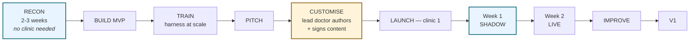
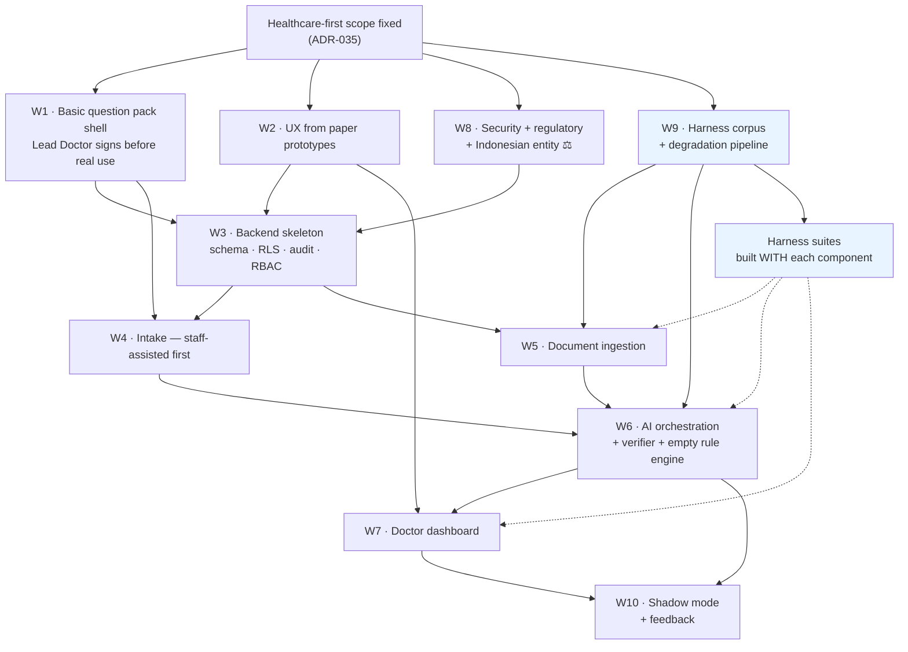

# Deliverable 16 — Development Roadmap (v2)

**Supersedes the v1.0 roadmap.** The founder's sequence is adopted with two insertions. Organised by dependency; durations are effort bands, not commitments.

> ### v2.4 amendment - healthcare-first narrow MVP
>
> Session H records an explicit founder decision to defer/skip the Evidence Sprint for now and proceed with healthcare first. The current operational roadmap is `ROADMAP.md` and ADR-035. The immediate build is a narrow OPD workflow: basic personal information, patient 2-3 line issue description, Lead-Doctor-approved basic questions, optional previous-report attachments, and a doctor brief pushed to tablet/phone. Best initial patients are first clinic visits with no previous reports.
>
> The old RECON/Evidence Sprint discovery risk is accepted, not erased. Do not use this amendment to add AI diagnosis, treatment advice, visible differential, unsigned clinical questions, or production red-flag content.

---

## 1. The sequence



Two additions to the founder's sequence, both cheap, both removing a large risk:

| Insertion | Cost | Removes |
|---|---|---|
| **RECON before BUILD** | 2–3 weeks, no signed clinic required | Building an OCR pipeline against imagined documents — the classic three-month waste |
| **Week 1 of the on-site fortnight is SHADOW** | Zero — same two weeks | Going live at clinic 1 on content signed a week earlier |

---

## 2. RECON — before any production code

**No clinic contract required.** Discovery needs documents and observation, both obtainable in Jakarta without signing anything.

| Activity | Output | Why it gates the build |
|---|---|---|
| Collect **100–200 real Indonesian prior records** (consented individuals, pharmacies, your network, public lab formats) | Document taxonomy + the harness's founding corpus | **Determines the entire OCR architecture and the variable cost model** |
| Sit in **3–4 clinic waiting rooms** | Complaint mix, consultation duration, device ownership, patient flow | Determines the question bank scope and whether intake is plausible at all |
| **Wizard-of-Oz intake** — a human with a tablet, 30–50 patients | Completion rate, duration, refusal rate, assistance need | **The single highest-value experiment in the project** |
| Observe **P-Care and a clinic EMR** over a shoulder | Double-entry count | May reframe the entire value proposition |
| Collect the **vocabulary patients actually use** | `masuk angin`-class complaint list | Localisation input that no translator can supply |
| Time **consultations by complaint** | Baseline | Without it the primary metric is unmeasurable and the pilot proves nothing |

**Exit criteria:** document taxonomy documented · top-10 complaints identified · intake completion rate observed · consultation baseline recorded · ≥100 documents in hand with ground-truth annotation started.

**Go/no-go.** If observed intake completion in the Wizard-of-Oz study is very low and cannot be explained by fixable friction, stop and rethink before writing production code.

---

## 3. BUILD MVP

Scope per [MVP-Scope.md](../02-Product/MVP-Scope.md) as revised in v2.4 — **note the red-flag engine ships with an empty rule set**, and the first MVP treats previous reports as doctor-reviewable attachments unless facts are human-confirmed.

### Workstream dependencies



### The two sequencing decisions that matter

**1. The harness is built alongside, and three of its suites are built *before* the components they test.**

| Suite | Built before | So that |
|---|---|---|
| Corruption + abstention (B, E) | The extractor | The extractor is built to satisfy an abstention test rather than having one applied afterwards |
| Contamination + failure injection (A, D) | The orchestrator | Isolation is designed against a test that already exists |
| Drift gate (F) | The first synthesis prompt | Diagnostic drift is unmergeable from the first commit |

**An extractor built to pass an abstention test behaves differently from one that has abstention tested afterwards.** That is the entire argument for this ordering.

**2. Staff-assisted intake before self-service.** It is the path that always works, it validates the content with a controlled user, and it de-risks the completion-rate problem that is the most likely cause of total failure.

### Effort bands

| Workstream | Band | Notes |
|---|---|---|
| W3 Backend skeleton | ~5 wk | **Do not compress.** All of it is a rewrite if retrofitted |
| W4 Intake | ~6 wk | Staff-assisted first; include 2-3 line issue description |
| W5 Documents | ~7 wk | Narrow first MVP can ship attachment viewing before trusted extraction |
| W6 Orchestration | ~6 wk | Includes the empty rule engine and verifier |
| W7 Doctor dashboard | ~6 wk | Performance is the hard part |
| W9 Harness | ~5 wk | Overlaps everything; corpus work starts in RECON |
| W10 Shadow + feedback | ~4 wk | |
| W1/W2/W8 | Continuous | Content, UX, security, regulatory |

---

## 4. TRAIN

The founder's TRAIN step, specified. **This is not model training** — see [12-Harness/Harness-Architecture.md](../12-Harness/Harness-Architecture.md) §1.

| Activity | Output |
|---|---|
| Scale the harness to full volume (~12,000 cases) | Complete attack coverage |
| Run all 11 attack classes | Gate and threshold metrics |
| **Outsider red team** (Class K) | The failures automation could not find |
| Calibration measurement | Reliability curve |
| Fix, re-run, repeat until gates are clean | A clean signed run |
| Generate the **pitch dossier** in both locales | The pitch asset |

**Exit criteria:** all nine gate metrics at zero · all threshold metrics met · red-team findings closed or documented · dossier generated from a signed run.

**If a gate metric will not go to zero, that is the finding.** Do not pitch around it.

---

## 5. PITCH

Per [12-Harness/Pitch-Dossier.md](../12-Harness/Pitch-Dossier.md) §3. The demo runs on **synthetic patients only**, every screen carrying a visible `UNVALIDATED — DEMO CONTENT` marker.

**The two-part argument:**
1. It saves consultation time — *unproven, and say so*
2. It produces structured, export-ready clinical data for a mandate you are already sanctioned against, and stops you typing the same encounter twice — *present and funded*

**Exit criteria:** a clinic and a **named lead doctor** willing to author clinical content · written data agreement ⚖️ · entity and contracting resolved ⚖️.

---

## 6. CUSTOMISE — where clinical governance actually happens

**This stage replaces the clinical safety owner retainer.** It is the most important stage in the plan and the one most likely to be rushed.

| Activity | Owner | Output |
|---|---|---|
| Lead doctor **reviews and corrects the question bank** | Lead doctor 🩺 | Signed content pack v1.0 |
| Lead doctor **authors the red-flag rules** — from empty | Lead doctor 🩺 | Signed rule set (or a deliberate decision to launch with none) |
| Lead doctor reviews the **prohibited-language list** | Lead doctor 🩺 | Signed |
| **Bahasa Indonesia clinical review** | Lead doctor + reviewer 🩺 | Signed locale |
| Local complaint additions (`masuk angin` etc.) | Lead doctor 🩺 | Extended bank |
| **Adversarial review** — the doctor tries to break it with real cases | Lead doctor | Regression cases; the best possible first act of the relationship |
| Clinic configuration | Us | Locale, retention, roles, queue |
| Staff identified and scheduled for training | Clinic | Named people |

**Exit criteria — none is optional:**
- [ ] Content pack **signed by a named doctor** 🩺
- [ ] Red-flag rules signed, **or a signed decision to run with none**
- [ ] Bahasa Indonesia clinical strings signed
- [ ] `UNVALIDATED` markers removed **only** for signed content
- [ ] Harness re-run against the customised content pack
- [ ] Regulatory position confirmed in writing ⚖️

**The floor:** no real patient data is processed until this stage completes. An empty rule set is safe; an unsigned question bank running on real patients is not.

---

## 7. LAUNCH — clinic 1, two weeks on site

### Week 1 — SHADOW

System runs on real patients. Staff train on it. Data is captured. **The doctor does not rely on it.**

| Activity | Purpose |
|---|---|
| Full pipeline on real encounters | Real-distribution quality measurement |
| Staff training with real patients, supervised | Assisted intake, read-back, document capture |
| Doctor sees output but works as normal | Familiarity without dependence |
| Daily review with the lead doctor | Catch content problems in hours |
| Measure completion, latency, extraction accuracy | The numbers the pitch promised |
| Harness regression cases added from real failures | The suite grows |

**Week 1 exit gate:** zero contamination · zero fabricated values reaching a doctor · intake completion ≥50% · extraction accuracy within the dossier's stated range · lead doctor content-signs any corrections.

**If week 1 fails its gate, week 2 does not start.** That is the entire reason week 1 exists.

### Week 2 — LIVE

Doctor uses it in the consultation. On-site presence throughout. Daily safety review.

| Activity | Purpose |
|---|---|
| Live use by the lead doctor, then others | The real test |
| Consultation timing vs the RECON baseline | The primary metric |
| Feedback capture | Content improvement signal |
| Kill switch available and explicitly encouraged | Autonomy reduces reluctance to try |
| Staff independence check | Can they run it without us? |

**Halt conditions (immediate):** any wrong-patient association · any fabricated clinical value reaching a signed note · any "clinically unsafe" rating not explicable as a UI misunderstanding · any consent or cohort gate failure · any request from the clinic.

---

## 8. IMPROVE → V1

| Activity | Output |
|---|---|
| Fix everything weeks 1–2 revealed | Prioritised by clinical severity, then friction |
| Add every real failure to the harness permanently | A suite that only grows |
| Content revisions with the lead doctor | Signed pack v1.1 |
| Re-run the full harness | Clean signed run |
| Write the honest readout | Time saved with its confounders stated |
| Decide Phase 2 exposures | Differential, learned ranker, SATUSEHAT |

**V1 exit:** clinic 1 operating without daily support · all gates clean · readout written · lead doctor willing to be a reference.

**That last item is the real exit criterion.** A clinic that keeps using it but will not recommend it has told you something the metrics have not.

---

## 9. Critical path

```
RECON documents + observation
  → Clinical content v0 (unsigned, from published frameworks)
    → Backend skeleton (schema · RLS · audit)
      → Document ingestion          ← LONGEST LEAD, de-risked by RECON
        → AI orchestration + verifier + empty rule engine
          → Doctor dashboard
            → TRAIN (harness at scale)
              → PITCH
                → CUSTOMISE (lead doctor signs)   ← CLINICAL GOVERNANCE HAPPENS HERE
                  → Week 1 shadow → Week 2 live
                    → V1
```

**Two things are no longer on the critical path** compared with v1.0: hiring a clinical safety owner, and securing a clinic before building. **One thing was added:** the harness corpus, which starts in RECON because it takes the longest to assemble.

**Still true:** the AI is not on the critical path. Documents and clinical content are.

---

## 10. Team (v2)

| Role | Commitment | From |
|---|---|---|
| Tech lead / CTO | Full-time | RECON |
| Backend / AI engineer ×2 | Full-time | RECON (one), BUILD (second) |
| Frontend engineer | Full-time | BUILD |
| Product designer / researcher | Full-time to launch | **RECON — they run it** |
| QA / harness engineer | Full-time | BUILD |
| Founder | Full-time | RECON |
| **Lead doctor at clinic 1** 🩺 | **From CUSTOMISE** | **Unpaid — it is their clinic and their content** |
| Optional clinical proofread | **~10–15 hours, once, before PITCH** | Fixed scope, not a retainer |
| Security / privacy advisor ⚖️ | ~2 days/month | RECON |
| Indonesian regulatory + corporate counsel ⚖️ | Advisory | **RECON — entity and classification both have long lead times** |

**Six full-time, two advisory, one optional proofread.** The retainer is gone; the governance is not — it moved to CUSTOMISE, where it is free and where it also improves the sales relationship.

## v2.2 Reconciliation

As of v2.3, this document is retained as historical development detail. The current operational sequence is in `ROADMAP.md`: EVIDENCE SPRINT -> MVP -> HARNESS + SYSTEM HARDENING -> PITCH -> CUSTOMISE WITH DOMAIN EXPERT -> CLIENT 1 SHADOW -> CLIENT 1 LIVE -> 2-WEEK ONSITE ASSISTANCE -> IMPROVE -> V1 FREEZE. Exit gates include passing prototype/harness tests, no hard-coded test counts, content source registry, empty production rules, domain-expert sign-off, and legal checkpoints before real patient/client processing.

As of v2.4, ADR-035 supersedes the immediate sequence: Evidence Sprint is deferred by explicit founder instruction and healthcare-first narrow MVP work may proceed. Current build scope is personal information -> short issue description -> approved basic questions -> optional report attachments -> doctor brief. The Evidence Sprint risk remains documented and accepted, not disproven.

