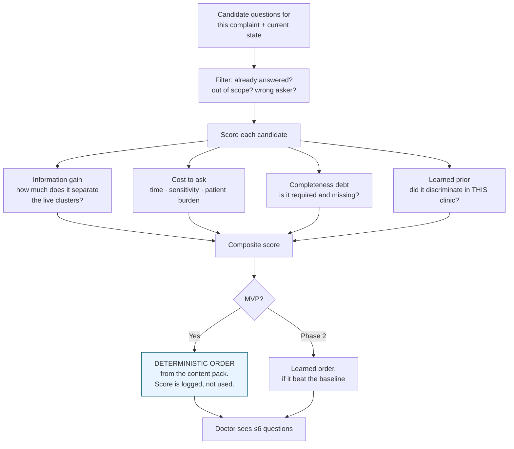
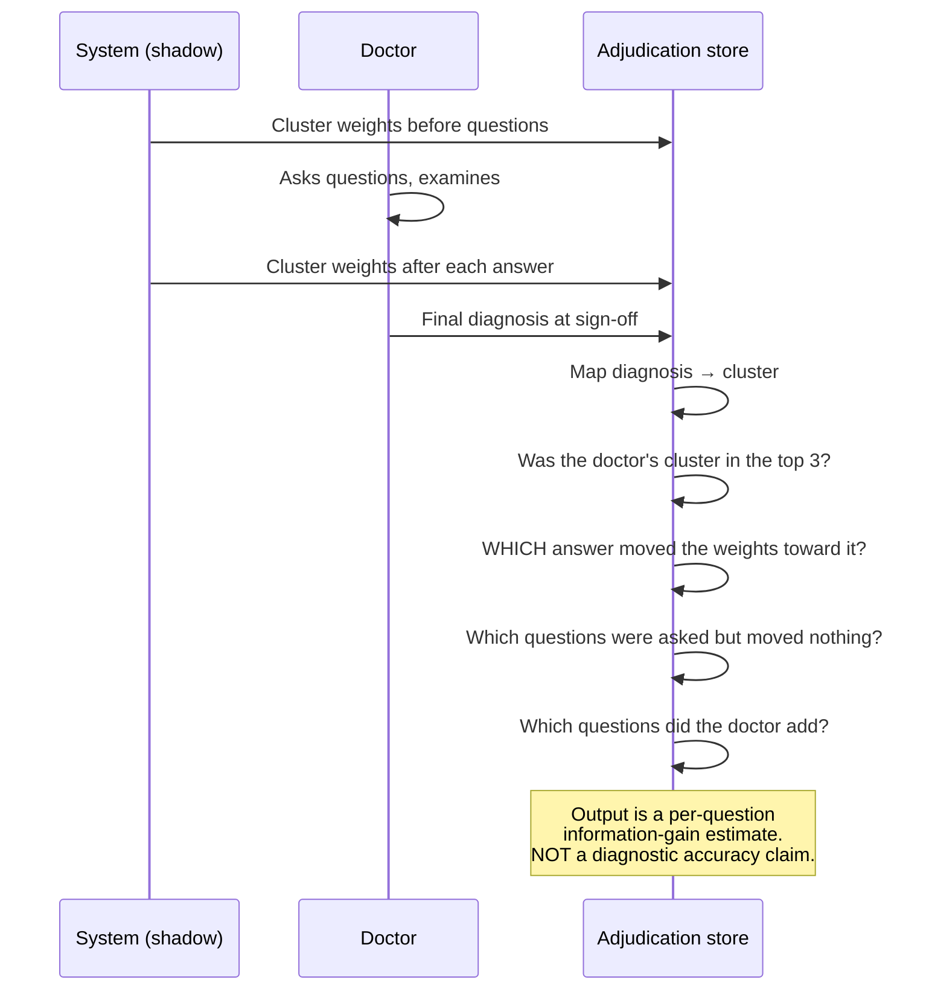

# The Counter-Question Knowledge Graph

**What the founder asked for:** *"aware of most common diseases and their symptoms and most importantly counter questions… this data will not make the diagnoses or conclusions, it will just improve the possible questions to ask, and in shadow, the probability comparison with doctor conclusion."*

**That is exactly the right instinct, and it is achievable — provided the knowledge is stored as questions rather than as conclusions.** This document specifies how.

---

## 1. The central design choice

There are two ways to encode clinical knowledge. They look similar and behave completely differently.

| | **Condition-centred** (rejected) | **Question-centred** (adopted) |
|---|---|---|
| Stores | *Condition X presents with symptoms A, B, C* | *Question Q separates possibility P₁ from P₂* |
| Natural output | A ranked list of conditions — a differential | A ranked list of questions to ask |
| Regulatory posture | "Inform clinical management" at minimum ⚖️ | Closer to a structured history-taking aid |
| Failure mode | Anchors the clinician on a wrong hypothesis | Asks a question of low value — recoverable |
| What a doctor sees | Our opinion about their patient | A prompt they can ignore |

**We store discriminating questions, not disease profiles.** The same underlying medical knowledge is present; the shape of it determines what the system can accidentally become. A condition-centred store wants to emit a differential. A question-centred store cannot — it has no conclusions to emit.

## 2. Schema

```python
@dataclass
class DiscriminatingQuestion:
    question_key: str
    chief_complaint_scope: list[str]
    text_by_locale: dict[str, str]        # en, id — clinician-reviewed, never MT
    answer_type: str
    options: list[dict]

    # ---- the knowledge, expressed as separation, never as assertion ----
    separates: list[Separation]
    # e.g. Separation(if_answer="YES", raises="possibility_cluster_A",
    #                 lowers="possibility_cluster_B", strength="MODERATE")

    clinical_rationale: str               # required — forces the author to justify it
    is_red_flag_screen: bool              # inactive in MVP (empty rule set)
    cost_to_ask: int                      # 1 = trivial, 5 = sensitive/slow
    asked_of: list[str]                   # PATIENT | STAFF | DOCTOR
    source_ref: str                       # where this came from ⚖️ licence-checked
    authored_by: str
    reviewed_by: str | None               # null until a doctor signs
    content_version: str
```

```python
@dataclass
class PossibilityCluster:
    """A GROUP of related considerations — deliberately coarse.

    Clusters, not diagnoses. 'Cardiac-type chest pain' is a cluster;
    'unstable angina' is a diagnosis. The system reasons over clusters so
    that even its shadow output is one abstraction level away from a
    diagnosis, and so a clinician can disagree with a cluster without the
    system having claimed anything specific.
    """
    cluster_key: str                      # "chest_cardiac_type"
    label_by_locale: dict[str, str]
    typical_features: list[str]           # feature keys, not free text
    discriminating_questions: list[str]
    base_rate_hint: str | None            # "common" | "uncommon" | "rare" in OPD
                                          # NOTE: a coarse hint, never a prior probability
    never_shown_to_doctor_in_v1: bool = True
```

**`PossibilityCluster` is the closest thing to disease knowledge in the system, and three properties keep it safe:** it is coarse (clusters, not diagnoses), it is never rendered to a doctor in v1, and its only *purpose* is to compute which question to ask next.

## 3. Where the knowledge comes from ⚖️🩺

| Source | Use | Caution |
|---|---|---|
| **Published history-taking frameworks** (structured symptom characterisation, systems review) | Backbone of the question set | Widely taught; **confirm licensing of any specific published instrument before use** |
| **Open clinical curricula and public health-ministry materials** | Common presentations in Indonesian primary care | Verify licence and currency |
| **Kemenkes / national primary-care guidance** | Locally appropriate presentations and terminology | Authoritative for the market ⚖️ |
| **The lead doctor at CUSTOMISE** | Review, correction, local adaptation | **The signature that makes it clinical content rather than a draft** |
| **Doctor-added questions in production** | The highest-value gap signal | Enters as a candidate, never auto-activated |
| ❌ **Scraped textbooks, paywalled content, competitor content** | **Never** | Legally and reputationally fatal |

**Everything is `reviewed_by = null` until a doctor signs it.** The product renders unreviewed content with a visible `UNVALIDATED` marker, which is what makes shipping without a clinical safety owner honest rather than reckless.

## 4. How a question earns its rank



**In the MVP the score changes nothing.** It is computed, logged, and compared against the deterministic order offline. Only after it demonstrably beats that order on held-out data does it get to influence what a doctor sees — and even then it is reordering a fixed, clinician-authored set.

## 5. The shadow concordance loop

This is the founder's *"probability comparison with doctor conclusion"*, specified.



**What we compute:**

| Metric | Meaning | Use |
|---|---|---|
| **Top-3 cluster concordance** | Doctor's eventual diagnosis mapped into the top 3 shadow clusters | Phase 2 exposure gate — *never a marketing number* |
| **Per-question information gain** | How much a given answer shifted weights toward the doctor's eventual cluster | Trains the ranker |
| **Dead questions** | Asked often, never move anything | Retire candidates for clinical review |
| **Missing questions** | Doctor added their own; what were they after? | Highest-value content gap signal |
| **Time-to-resolution** | How many questions before the top cluster stabilises | Shorter question sets |
| **Calibration** | When the shadow says 0.7, is it right 70% of the time? | Honesty check |

**The critical discipline:** the doctor's diagnosis is an *outcome label for question value*, not a correctness target for the system. We are not scoring whether the machine agreed with the doctor. We are asking **which questions helped the doctor get there.** Those are different projects, and conflating them is how a question tool becomes a diagnostic tool by accident.

## 6. What ships, and what never ships

| Artefact | v1 MVP | Phase 2 | Ever shown to a doctor? |
|---|---|---|---|
| Question text and order | ✅ deterministic | ✅ learned order | ✅ Yes |
| Clinical rationale per question | ✅ | ✅ | ✅ One line |
| Possibility clusters | Computed, stored | Computed, stored | ❌ **No** |
| Cluster weights / probabilities | Computed, stored | Computed, stored | ❌ **No** |
| Shadow differential | Computed, stored | Gated exposure after validation ⚖️ | ❌ Not in v1 |
| Concordance statistics | Internal | Internal + gate | ❌ Internal only |

**A doctor in v1 sees questions, in an order, with a reason. Nothing else from this subsystem reaches them.**

## 7. Scores are rankings, never probabilities ⭐

*Adopted v2.1 from external review.*

**Rule: no number produced by this subsystem is ever described, stored, logged or displayed as a probability that a patient has a condition.**

| ❌ Never | ✅ Always |
|---|---|
| "83% chance of X" | "Shadow rank 2 of 5" |
| `probability: 0.83` | `hypothesis_score: 0.83` (unitless, uncalibrated, internal) |
| "likely diagnosis" | "cluster weight" |
| "confidence in diagnosis" | "separation strength" |

**Why this is a real rule and not pedantry.** LLM-derived scores are not calibrated disease probabilities — they are the model's internal ordering, which correlates with plausibility and not with population prevalence. Presenting one as a probability is a clinical claim we cannot support and, in Indonesia, a claim that would push the product firmly across the medical-device line ⚖️.

**And the vocabulary leaks.** A field called `probability` in a database in 2026 becomes a percentage on a doctor's screen in 2028, because by then nobody remembers it was never calibrated. **The naming is the control.** Field names, log lines, internal dashboards and adjudication tooling all use `hypothesis_score` and `rank`.

Probability language becomes permissible only if and when a **calibration dataset** exists and calibration has been demonstrated on held-out data — a Phase 3 question at the earliest, with its own gate.

## 8. Governance

1. **No question enters the active bank without a clinician's signature.** Unreviewed questions are visibly marked `UNVALIDATED` and are excluded from any encounter involving real patient data.
2. **The ranker trains offline**, on a versioned, consented, de-identified dataset. No online learning. No path from a click to a model artefact.
3. **The ranker cannot invent, reword, or remove a question** — it emits an ordering over a fixed set.
4. **Retirement requires clinical review.** A persistently dead question raises a review task; it is not silently dropped. A statistic never retires clinical content on its own.
5. **Every question carries `source_ref`**, and any source whose licence is unverified is excluded ⚖️.
6. **Subgroup parity is checked on the ranker** exactly as on everything else — a ranker that works well in Bahasa Indonesia and poorly in English, or well for self-service and poorly for staff-assisted, fails the gate.

## 9. Honest limitations

- **Coverage is bounded by what was authored.** An unusual presentation gets the general question set. The doctor-added-question signal is how that boundary moves, and it moves slowly.
- **Concordance is not accuracy.** A doctor's working diagnosis at sign-off is not ground truth; it is a clinician's judgement at one moment, sometimes revised later. Treat it as a strong signal, never as truth.
- **Cluster mapping is lossy.** Mapping a free-text diagnosis to a coarse cluster involves judgement, and disagreement in that mapping shows up as noise in every downstream number. Report the mapping's inter-rater agreement alongside the concordance figure, or the concordance figure is meaningless.
- **The learned prior is clinic-specific.** What discriminates in a Jakarta *klinik pratama* may not transfer to a rural *puskesmas*. Rankers are per-tenant by default, with a global fallback.

## v2.2 Reconciliation

Separate patient concept, internal clinical possibility graph, and question graph. Rank questions with deterministic configurable utility, not pure information gain. Labels are quality-tiered and never automatically produced from doctor clicks. Proposed ranker/content changes move through offline release and clinical review when clinically material.

